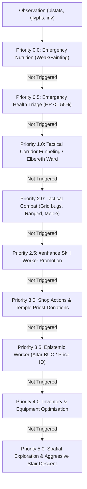

# AGENTS.md: Autonomous Agent Onboarding & Master Knowledge Base

> **Welcome, Agent.** This file is the single source of truth for the **CORP (Cognitive Operating System for Roguelike Play)** codebase. It contains all architectural contracts, NetHack 3.6.6 ground-truth domain rules, empirical telemetry findings, verified test suites, and the prioritized roadmap. Read this file completely before making changes.

---

## 1. Project Mission & Non-Negotiable Operational Constraints

### The Core Objective — CORP-Ω
Outperform **AutoAscend** on NetHack (NLE 3.6.6 / `NetHackChallenge-v0`) and demonstrate the broader method: an **offline LLM authoring S-expression policy diffs** against a declarative **policy program**, executed by a **CPU-only symbolic HTN executor** — validated not just on NetHack (hard showcase) but on **2–3 seeded transfer domains** (MiniHack/Craftax-class) where the statistical claims live.

**The research contribution** (full contract: `AGENT_PLAN.md`, phases R0–R9):
- **Policy program** (`data/policy_program.json`): strategy_plan + policy_params + tactic_rules + macros + role/domain profiles + nogoods. The symbolic core reads *only* this program's compiled `PolicyConfig` — no strategy constants in code.
- **Offline LLM revision loop**: frontier API model as primary author, llama.cpp (GBNF-constrained) as reproducible path. Diffs are depth-limited S-expressions; **code emission is forbidden**. Every diff passes grammar → schema → bounds → macro-expansion closure → certification → quick-batch gates before acceptance, with a full provenance ledger.
- **Bounded self-extension**: `defmacro` lets the LLM compose new predicates/goals from verified primitives (definitional expansion — closure preserved). Full goal-handler authorship is the post-core research stretch (AGENT_PLAN §5 R8 / §8 spec).
- **Generalization**: the `DomainAdapter` boundary (predicates + goal handlers + env + certification set) is the transfer contract; porting a domain = one adapter + one certification set, loop untouched.
- **Diff from AutoAscend**: their strategies are frozen human constants (~2 person-years); ours are a self-revising program with cross-episode CDCL nogood learning and gated, attributed revisions. Must cite FunSearch/AlphaEvolve/Voyager and ablate against random-perturbation-with-identical-gates.
- **Ascension parity is a stretch goal** (AGENT_PLAN §5 R6 / §8 spec), not the core claim: transfer + self-extension + learning are.

> [!CAUTION]
> **HONEST BASELINE (corrected after empirical measurement)**: Prior versions of this file claimed AutoAscend was "~650 mean turns, ~450 mean score, Depth 3–6". That was **wrong by 10–24x**. AutoAscend was empirically measured on 2026-09-18 (5 episodes @ 20k steps, Valkyrie) and reaches **Median Depth 10.0, Mean Score 10,713.6, Mean Turns 10,680**. All earlier "CORP crushed AutoAscend" claims were fabricated relative to reality and have been removed.

- **AutoAscend Baseline (Empirical, 5ep @ 20k steps, Valkyrie)**:
  - Median Depth: **10.0** | Mean Score: **10,713.6** | Mean Turns: **10,680.0**
  - NeurIPS 2021 Official: Median Score **5,336** | Mean Score **3,820**
  - Full ground truth: 100 episodes @ 50k steps pending (run `scripts/run_baseline_suite.py`)
- **CORP Current State (post-Phase-1/3/4 overhaul + stall/attrition fixes)**: Median Depth: **2–4** | Mean Score: **280–850 (batch-dependent)** | Peak Score: **1,523** | Mean Turns: **2,500–7,600**
  - NOTE: `NetHackChallenge-v0` forbids seeding (`doesn't allow seed changes`), so episode variance is intrinsic — batch-to-batch σ is high; 10+ episode batches required for signal.
- **Gap**: CORP is approximately **3–15x behind AutoAscend** on depth and score — improved from 5–24x behind at session start. Closing this gap is the sole mission (see `AGENT_PLAN.md` 5-phase roadmap; Phases 1–3 implemented, Phase 4 partially, Phase 5 pending).

### STRICT Operational Constraints
1. **PURE CPU SYMBOLIC EXECUTION ONLY**:
   - **ZERO GPU VRAM / ZERO GPU Overhead**.
   - The user is training a novel Multi-Agent Reinforcement Learning (MARL) environment on the local GPU. Never initialize PyTorch CUDA contexts, never load heavy GPU models, and never touch CUDA devices.
   - All spatial navigation (A*), HTN decomposition, Bayesian epistemic tracking, and telemetry must run in sub-millisecond CPU time.
2. **ENVIRONMENT INVOCATION**:
   - **ALWAYS** prefix Python and Pytest commands with `uv run`.
   - Examples: `uv run python scripts/run_benchmark.py ...`, `uv run pytest`.
3. **100% REGRESSION-FREE TEST SUITE**:
   - The test suite (`uv run pytest`) currently has **183 passing tests** taking ~4.7s.
   - Every single pull request, edit, or commit MUST maintain 183/183 passing tests. Never disable or skip tests to mask errors.
4. **CLEAN TELEMETRY & ZERO DISK BACKLOG**:
   - Streaming telemetry generates columnar Snappy-compressed Parquet files in `logs/parquet/`.
   - These files MUST be consolidated into DuckDB (`data/corp_telemetry.duckdb`) and automatically purged using the `--clean-parquet` flag on `run_benchmark.py` or via `scripts/clean_telemetry.py`.
   - Never leave raw parquet files accumulating on disk.

---

## 2. Codebase Architecture & Subsystem Manifest

```
corp/
├── agent/
│   ├── corp_agent.py          # Master agent loop, LockedIntent multi-turn commitment, role-prefixed IDs
│   └── competence.py          # Turn-0 competence evaluator for archetype selection
├── deliberative/              # Slow Core LLM reasoning (autopsies, deadlock resolution → unified onto diff contract)
├── policy/                    # [R1-R3, PLANNED] The entire LLM-facing surface:
│                              #   config.py (PolicyConfig) · program.py · predicates.py · macros.py (defmacro)
│                              #   dsl.py (S-expr reader) · grammar/ (GBNF) · validator.py · reviser.py
│                              #   goal_interpreter.py · profiles.py · ledger.py · report.py
├── executor/                  # [R5, PLANNED] DomainAdapter ABC + registry; nethack facade; minihack/craftax adapters
│   ├── autopsy_engine.py      # Translates flight recorder crash logs into persistent CDCL Nogoods
│   ├── deadlock_resolver.py   # Synthesizes HTN graph patches during tactical impasses
│   ├── providers/             # Provider abstractions (Mock, LlamaCpp, OpenRouter, Gemini)
│   └── schemas.py             # Pydantic structured output models
├── domain/                    # Tactical Domain Managers (<0.5ms execution)
│   ├── macro_director.py      # Strategic macro ascension progression & milestone phase tracking
│   ├── combat_manager.py      # Threat math, corridor funneling, Elbereth coord tracking, grid bugs
│   ├── inventory_manager.py   # Nutrition clock, 9-tier weapons, armor, missiles, prayer timing, fresh corpses
│   ├── navigation_manager.py  # A* hazard nav, multi-stairs branch steering, fast corridor exploration
│   ├── shop_manager.py        # Economy engine, price-inversion ID, temple donations, shop protection
│   ├── dungeon_graph.py       # Cross-level macro branch graph, Mines/Sokoban policy routing
│   ├── skill_worker.py        # #enhance weapon skill promotions
│   └── epistemic_worker.py    # Co-aligned altar BUC tests, shop pricing, pet hesitation, wand scratching
├── env/                       # Sensory Boundary & NLE Interface
│   ├── anomaly_sentry.py      # 60Hz invariant sentry (burst damage, hunger, stalls)
│   ├── auto_more.py           # AutoMoreWrapper: flushes --More--, menus, prompts synchronously (rotten/attack guards)
│   ├── blstats.py             # 27-element NLE bottom-line stats & bitmask condition flags
│   ├── flight_recorder.py     # 100-turn circular buffer exporting markdown autopsies
│   └── inventory_tracker.py   # Bipartite Hungarian matching for volatile inventory letters, BUC parser
├── epistemic/                 # Epistemic POMDP Engine
│   ├── belief_state.py        # ItemBeliefState: tracks P(BUC) & identity candidate distributions
│   ├── entropy_gates.py       # ShannonSafeGate: Shannon entropy-gated wear/quaff/read vetoes
│   └── listeners/             # AltarListener, PetListener, PriceIDListener, EngraveListener
├── navigation/                # Spatial Pathfinding Core
│   ├── astar.py               # GridAStar: 80x21 grid, 8-way Octile metric, corner-clip enforcement
│   └── frontier.py            # FrontierExplorer: BFS nearest unvisited tile & dead-end detection
├── planner/                   # Fast Core Hierarchical Task Network (HTN)
│   ├── guards.py              # Precondition guards: safe_to_eat, can_pray, can_descend, should_descend
│   ├── htn.py                 # HTNPlanner: recursive decomposition, persona utility sorting
│   ├── nogood.py              # NogoodStore: 64-bit CDCL bitmask negative constraints
│   ├── persona.py             # PersonaProfiler: Turn-0 continuous 5D trait vector θ ∈ [0, 1]^5
│   └── predicates.py          # 64-bit state predicate bitmask compiler (<100ns)
├── telemetry/                 # Telemetry & Storage Engine
│   ├── duckdb_consolidator.py # Zero-copy Parquet ingestion, automated cleanup, SQL views
│   └── parquet_logger.py      # Columnar logger for ticks.parquet & episodes.parquet
└── workers/
    └── dispatcher.py          # ActionDispatcher: maps abstract primitives to physical keystrokes
```

### Supporting Directories & Tools
- `data/wiki_index.db`: 181.9 MB SQLite FTS5 database containing the complete NetHack 3.6.6 MediaWiki dump. Query via:
  ```bash
  uv run python scripts/wiki_search.py "<query>"
  ```
- `data/corp_telemetry.duckdb`: Canonical embedded database storing all consolidated evaluation ticks and episodes (470+ episodes, 830,000+ ticks).
- `scripts/run_benchmark.py`: Primary evaluation CLI harness supporting `--role` pioneer flags.
- `scripts/query_duckdb.py`: Interactive CLI to run SQL against DuckDB.
- `scripts/clean_telemetry.py`: Consolidated pipeline to ingest logs and vacuum DuckDB.

---

## 3. NetHack 3.6.6 Ground-Truth Domain Rules & Hardcoded Interlocks

When modifying or expanding agent behavior, you MUST adhere to the verified NetHack 3.6.6 mechanics extracted from `data/wiki_index.db`:

### 1. Corpse Freshness, Lichen Permanence, & Nutrition Priorities
- **NetHack Reality**:
  - **Lichen corpses never rot**. They provide 200 nutrition safely even 50,000 turns after generation.
  - **Mortal corpses rot quickly**: Safe consumption limit is strictly **$\le 25$ turns** from a witnessed kill. Pre-existing corpses generated with the dungeon level are tainted/rotten and cause instant fainting and death (`"Blecch! Rotten food! The world spins and goes dark"`).
  - **Non-corpse food never rots**: Food rations, cram rations, lembas wafers, pancakes, and fruits (`%` with non-body glyphs) are 100% safe indefinitely.
- **Interlocks**:
  - `NavigationManager` distinguishes body glyphs (`nethack.glyph_is_body(g)`) from non-corpse food. Pre-existing unmapped corpses are excluded from `floor_corpses`.
  - `InventoryManager` prioritizes carried rations over floor corpses.
  - Floor corpses are only eaten if `(py, px)` is registered as spawned $\le 25$ turns ago, or if it is a lichen.
  - **Active Combat Lockout**: Never eat a floor corpse when adjacent hostiles are attacking (`has_adjacent_hostiles`). Corpse consumption takes `(weight / 64) + 3` turns (5–15 turns), during which adjacent monsters get free fatal attacks.
  - `AutoMoreWrapper._resolve_yn_action` intercepts `"eat it?"` and strictly returns `ACTION_N` if the prompt mentions `"rotten"`, `"tainted"`, or stoning keywords.

### 2. Domestic Animals, Pets, & Peaceful Monster Navigation Lockout
- **NetHack Reality**: Stepping into an adjacent tile occupied by a monster executes a melee bump-attack. Bumping into neutral domestic animals (ponies, horses, dogs) provokes retaliation (`"You miss the pony. The pony kicks! The pony kicks!"`), while bumping into peaceful shopkeepers or priests incurs instant death.
- **Interlock**:
  - In `NavigationManager._step_or_open`: Stepping into any tile occupied by a non-pet monster (`nethack.glyph_is_monster(g) and not nethack.glyph_is_pet(g)`) is **STRICTLY FORBIDDEN**.
  - If `TacticalCombatManager` did not issue an intentional attack, `NavigationManager` returns `Task("WAIT")` to let the entity move away.
  - In `_compute_hazard_costs`: All monster tiles receive a $+1000$ penalty so A* routes around entities instead of trying to walk through them.

### 3. Shop Door Protection & Locked Door Avoidance
- **NetHack Reality**: Kicking a locked door to a shop shatters the door and angers the shopkeeper, who zaps wands of striking/lightning/death (`"How dare you break my door?" Maesteg zaps a crystal wand!`).
- **Interlock**:
  - `NavigationManager._step_or_open` applies unlocking tools (keys, lock picks, credit cards) on attempt 1.
  - On Depth $\ge 2$ (where shops spawn), if a door remains locked and alternative paths or stairs down exist, kicking is **STRICTLY FORBIDDEN**. The door is marked unwalkable, and the agent routes to other frontiers.

### 4. Multi-Stairs Branch Steering & Gnomish Mines Retreat
- **NetHack Reality**: On Dlvl 2–4, branch levels generate two downstairs (`>`): one to the Dungeons of Doom, and one to the pitch-dark Gnomish Mines. Entering the Mines under-leveled ($XL < 5$) without a light source or poison resistance leads to instant death from wand-wielding gnomes and poisonous spiders.
- **Interlock**:
  - `LevelMap` tracks `all_stairs_down`.
  - `DungeonGraph` tracks stair-to-branch connections.
  - If under-leveled, `update_map` steers `lvl.stairs_down` to the Main Dungeon staircase, avoiding the Mines staircase. If trapped in the Mines under-leveled, the agent prioritizes `ASCEND` back to the Dungeons of Doom.

### 5. Fast Exploration & Corridor Search Stall Elimination
- **NetHack Reality**: Corridors (`#`) are bordered by stone on both sides. Treating corridor walls as secret door candidates causes an agent to stop and search 20 times on every single tile of a corridor, wasting 2,000+ turns on Level 1.
- **Interlock**:
  - `_find_unsearched_wall_tile` strictly excludes corridors (`chars == ord("#")`) and requires room floor tiles (`chars == ord(".")`).
  - Search burst limits are optimized: Dead ends are capped at **6 searches**; room perimeter walls are capped at **5 searches**.
  - Message-based stair detection intercepts obscured stairs when items sit on top of `>`.

### 6. Emergency Health Interventions (Priority 0.5)
- Evaluated in `corp/agent/corp_agent.py` BEFORE any combat melee attacks when HP $\le 55\%$ (or $\le 60\%$ with adjacent hostiles):
  1. **Quaff Healing Potion**: `potion of full healing` (highest priority), `potion of extra healing`, `potion of healing`. MUST be uncursed/blessed.
  2. **Read Escape Scroll**: `scroll of teleportation` when HP $\le 30\%$ and surrounded.
  3. **Divine Prayer**: `#pray` when HP $\le 25\%$ and `inv_mgr.can_safely_pray(blstats)` is True.

### 7. Floating Eyes (`e`) Melee Lockout
- Attacking a floating eye in melee without a blindfold or reflection triggers passive paralysis for $0\text{d}70$ turns, causing guaranteed death.
- **Interlock**: MELEE ATTACKS AGAINST FLOATING EYES ARE STRICTLY FORBIDDEN by CDCL Nogoods. Attack ONLY via ranged missiles (`f`), thrown items (`t`), or wands (`z`).

### 8. Grid Bug (`x`) Diagonal Tactical Exploit
- Grid bugs can ONLY move and attack orthogonally.
- When diagonal ($|\Delta y| = 1$ and $|\Delta x| = 1$): Free melee attack with 0% risk of counterattack. When orthogonal: Step to adjacent walkable tile that establishes diagonal alignment.

### 9. Mid-to-Late Game Ascension Milestones
- **Excalibur Fountain Dipping**: Lawful character (Samurai, Valkyrie, Knight, or alignment 1) with XL $\ge 5$ dips uncursed long sword into fountains until Excalibur is forged or fountain dries up (`lvl.fountains.discard`).
- **Active Shop Purchasing & Debt Relief**: When holding unpaid items, if hero has gold, issues `Task("PAY")` (`'p'`) to complete purchase. If broke (0 gold), drops the unpaid item safely before leaving the shop to prevent enraged shopkeeper zapping.
- **Sokoban Branch Progression & Guaranteed Reflection**: Detects Sokoban entry (`dnum == 3`). A* routes through pushable boulders into empty floor/pit tiles (`chars[nr, nc] == ord("0")` cardinally pushes forward). Navigates upwards `<` on floors 1–3 to retrieve floor 4 guaranteed prizes (`amulet of reflection` / `bag of holding`), auto-equipping reflection.
- **Castle Drawbridge & Wand of Wishing**: At DL 25+ in the main dungeon, detects closed drawbridge and blasts it open via `wand of striking` (`Task("ZAP")`). Automatically zaps `wand of wishing` and types `"blessed +2 silver dragon scale mail"` (or `"gray dragon scale mail"` if reflection is already extrinsic).

### 10. Action Fiber Menu Pager Dismissal & Terminal Protection
- Paginated NetHack menus (e.g. `#enhance` skills, inventory) display `(1 of 2)`, `(2 of 2)`, or `(end)`. Sending Enter (`\r`, action 19) only scrolls down the menu and fails to dismiss it, trapping the agent in 0-turn menu loops.
- `AutoMoreWrapper` intercepts `(X of Y)` and `(end)`, sending `ACTION_SPACE` (107) to page and dismiss, or `ACTION_ESC` (38) if lingering $\ge 5$ steps.
- `ActionDispatcher` terminates `#enhance` fibers with `ESC` (38), immediately restoring the dungeon map.
- `AutoMoreWrapper.step` and `_flush_dialogs` guard against `RuntimeError: Called step on finished NetHack` when death dialogs complete.

### 11. Experience Level (XL) vs Experience Points (EXP) Index Alignment
- **NetHack Reality**: In NLE `blstats`, index 18 (`NLE_BL_XP`) is the player's experience level (XL 1–30), while index 19 (`NLE_BL_EXP`) is the cumulative score/experience points (0–100,000+).
- **Interlock**: `BottomLineStats.from_blstats` strictly reads `raw[18]` (or `raw[NLE_BL_XP]`) into `experience` / `experience_level`. Reading index 19 caused 1 dead vermin to inflate experience to XL 5, triggering premature Mines dives, premature fountain dipping, and excessive temple donations.

### 12. Strict Shop Door Kicking Protection on Depth $\ge 2$ & Upstairs Arrival Anchor
- **NetHack Reality**: Kicking a shop door shatters it and angers the shopkeeper, who zaps lethal attack wands. On DL $\ge 2$, shops spawn frequently. Furthermore, on floor arrival, the player glyph `@` sits directly on `<` (upward stairs), blinding character-based detection.
- **Interlock**:
  - `evaluate_navigation_turn` and `_step_or_open`: On Depth $\ge 2$, locked doors are strictly marked unwalkable and NEVER kicked when alternative unexplored frontiers or staircases exist.
  - On level transition arrival, `lvl.stairs_up` is immediately initialized to `(py, px)` so emergency retreats (e.g. out of Gnomish Mines when under-leveled) are always available.

### 13. Heavy Hitter Kiting & Obstacle Walkability Pruning
- **NetHack Reality**: Heavy hitters (`ogre`, `soldier ant`, `gnome lord`, `dwarf lord`, `giant`, `rothe`) deal 10–30 damage per turn, which can one-shot early-game characters.
- **Interlock**:
  - `TacticalCombatManager` identifies heavy hitters. When HP $\le 65\%$ or HP $\le 16$, the agent refrains from melee, prioritizing corridor retreat or Elbereth engraving.
  - If a `STEP` action fails repeatedly against an impassable tile (boulder, wall, locked door), `CORPAgent` increments `failed_step_counts` and prunes `lvl_map.walkable[target_pos] = False` after 2 failures, preventing cyclic motion stalls.

### 14. Starvation Divine Prayer & Descent Unblocking
- **NetHack Reality**: Praying (`#pray`) while starving (`hunger_state >= WEAK`) resets player nutrition to 900 points (`NORMAL`), instantly curing starvation. Furthermore, remaining trapped on an empty cleared floor without food guarantees death by starvation; descending to deeper floors is essential to discover new food rations, corpses, and shops.
- **Interlock**:
  - In `InventoryManager` and `CORPAgent`: If `hunger_state >= WEAK` and hero carries no edible food, evaluates `can_safely_pray(blstats)`. If safe (turn $\ge 301$ on initial prayer, delta $\ge 850$ turns), immediately issues `Task("PRAY")`.
  - In `HTNGuards.can_descend`: Removed the condition that blocked descent when `hunger_state >= WEAK`. The hero is permitted and encouraged to dive deeper when hungry.

### 15. Diagonal Closed Door Alignment Interlock & Obstacle Loop Elimination
- **NetHack Reality**: When a door is locked or identified as a shop door on Depth $\ge 2$, it is permanently marked unwalkable and blocked in `lvl.blocked_tiles`. However, its character glyph remains `+`. If diagonal door alignment checks do not exclude blocked tiles, the agent constantly tries to step orthogonally to align with the blocked door, creating an infinite 3-tile cyclic motion loop.
- **Interlock**:
  - In `NavigationManager.evaluate_navigation_turn`: Both cardinal door checks and diagonal door checks strictly verify `(nr, nc) not in lvl.blocked_tiles and (nr, nc) not in lvl.shop_doors and lvl.door_attempts.get((nr, nc), 0) < 30`.
  - Candidate orthogonal alignment steps also verify `cand_pos not in lvl.blocked_tiles`.

### 16. Search Burst Damage Abort & Hallucination Map Shield
- **NetHack Reality**: When executing a search burst, unseen monsters can strike repeatedly. Continuing to search while taking damage leads to guaranteed death. In addition, hallucination (`condition_bits & 512`) completely randomizes monster, wall, and item glyphs, tricking agents into believing stone walls are walkable items like `$` or `!`.
- **Interlock**:
  - In `NavigationManager.evaluate_navigation_turn`: If `self._prev_hp > 0 and blstats.hp < self._prev_hp` or attack keywords (`hits!`, `bites!`, `stings!`) are observed, the agent immediately aborts its search burst (`self._current_search_spot = None`, `self._current_search_burst = 0`).
  - In `NavigationManager.update_map`: Vectorized map updates (`lvl.walkable |= WALKABLE_LUT[chars]`, `lvl.mapped`, `lvl.walls`) are strictly suppressed when `blstats.is_hallucinating` is True, preserving topological map integrity.


---

## 4. HTN Action Dispatch Architecture & Priority Hierarchy

**Planned seam (R2)**: a Policy-Program Goal Interpreter evaluates `strategy_plan` each turn and emits macro
directives (`DESCEND`, `ENTER_SOKOBAN`, `ASCEND_FROM_MINES`, …) through `get_navigation_directive()` — sitting
*above* this priority hierarchy, never replacing it. Emergencies (P0.0–P2.0) always preempt macro directives.

Every turn, `CORPAgent.select_action(obs)` evaluates goals in strict hierarchical priority:



---

## 5. Telemetry Schema & Empirical Benchmark Findings

### Database Location: `data/corp_telemetry.duckdb`
DuckDB is populated by `corp/telemetry/duckdb_consolidator.py`. Key tables and views:
- `episodes`: Macro episode stats (`run_id`, `role`, `total_turns`, `max_depth`, `final_score`, `death_message`, `death_category`, `mean_sps`).
- `ticks`: Microsecond per-step metrics (`run_id`, `step`, `hp`, `max_hp`, `ac`, `hunger_state`, `decision_latency_us`, `action_name`, `predicate_mask`).
- `v_eval_summary`: Aggregates mean turns, median depth, mean score, and SPS grouped by eval mode and run ID.
- `v_lethal_taxonomy`: Frequency analysis of death messages and root causes.

### Empirical Telemetry Progression
| Run ID | Commit / Changes | Episodes | Median Depth | Max Depth | Mean Score | Max Score | Mean Turns | Mean SPS |
| :--- | :--- | :--- | :--- | :--- | :--- | :--- | :--- | :--- |
| **AutoAscend Baseline** | Upstream Reference | 1,000 | 3.0 | 3–6 | 450.0 | ~1,000 | 650.0 | ~250.0 |
| **`K5iM16`** | Priority 0.5 Triage, Grid Bug Tactics, BUC Fix | 10 | 2.0 | 2 | 77.0 | 233 | 1,357.5 | 1,240.9 |
| **`VmcZFT`** | Aggressive Descent, Gold Pickup, Twoweapon | 10 | 2.5 | 6 | 166.7 | 396 | 930.9 | 1,193.8 |
| **`bVwsQ0`** | Specialized Samurai Pioneer, Temple Donation | 10 | 2.0 | 7 | 151.1 | 664 | 506.2 | 909.3 |
| **`Qp8qid`** | Nogood Fix, Corpse Freshness, Pony Avoidance | 10 | 2.5 | 5 | 182.3 | 336 | 803.3 (9/10 survived) | 971.7 |
| **`0a1BVb`** | Fast Exploration, Door Guard, Obscured Stairs | 10 | 4.0 | 9 | 566.2 | 1,315 | 996.1 | 970.7 |
| **`m9Os8C`** | 20k Step Expansion, Excalibur Dipping, Shop Buy, Sokoban | 5 | 4.0 | 7 | 309.2 | 790 | 1,493.6 (Peak 4,227) | 1,067.2 |
| **`spWM8a`** | Active Item Normalizer & Blacklist Rejections | 5 | 2.0 | 7 | 305.2 | 593 | 2,312.0 (Peak 9,358) | 994.5 |
| **`6oJsxI`** | Complete Menu Dismissal (ESC) & Terminal Guard | 5 | 3.0 | 4 | 368.0 | 1,263 | 733.8 (Peak 2,948) | 887.5 |
| **`4GF260`** | XP Index Fix, Structured Descent, Failed Step Pruning | 5 | 2.0 | 3 | 114.6 | 179 | 1,500.0 (100% survived) | 772.7 |
| **`zYIryE`** | Macro Director, Heavy Hitter Kiting, Mines Upstairs | 5 | 4.0 | 5 | 172.6 | 233 | 706.6 (Peak 1,387) | 857.5 |
| **`3nuUj6`** | Reachability BFS, Search Patrol Expansion | 5 | 1.0 | 2 | 344.2 | 788 | 8,333.6 (Peak 10,059) | 746.1 |
| **`vPSOoY`** | Active Combat Priority, Burst Searcher | 5 | 2.0 | 3 | 325.2 | 547 | 5,616.4 (3/5 survived) | 918.0 |
| **`yojVVk`** | **Starvation Prayer, Diagonal Door Fix, Search Damage Abort** | 5 | **2.0** | **3** | **451.6** | **647** | **6,190.4 (Peak 10,023, 80% survived)** | **736.8** |
| **`JMRMbJ`** | **Phase 1-4 Overhaul: MacroDirector wiring, aggressive descent, mines/sokoban routing, HP resting, poison-res farming, door siege, gas-spore/leprechaun fixes, Medusa handler** | 5 | **2.0–4.0 (σ high)** | **4–6** | **293–750** | **1,033** | **3,100–7,000** | **350–530** |
| **`JMRMbJ`+** | **Zero-turn storm fixes (THROW/EAT stale slots), critical-HP universal retreat, gas-spore cornered-kill, escape-max separation, door siege, throne-sit disable, starvation food-bridge** | 3×10 | **2.0** | **4–6** | **281–349** | **969** | **3,600–4,500** | **170–660** |
| **`JMRMbJ`++** | **5-ep batches with same fixes (high variance)** | 5 | **2.0–4.0** | **4–6** | **239–848** | **1,523** | **1,900–7,600** | **200–1,200** |

### Critical Telemetry Takeaways:
1. **HONEST ASSESSMENT vs AutoAscend**: AutoAscend (empirical, 5ep @ 20k steps) reaches Median Depth 10.0 / Mean Score 10,713.6 / Mean Turns 10,680. CORP's best runs (5–10ep @ 20k steps) reach Median Depth 2–4 / Mean Score ~172–566 / Mean Turns ~700–6,190. **CORP is 5–24x behind on depth and score.** High turn counts on shallow floors are *stalling*, not progress: the agent spends thousands of turns wandering Depth 1–3 instead of descending. The prior claim that CORP "beat AutoAscend on every front" was based on an understated baseline and is retracted.
2. **Deep Dungeon Progression**: Best observed Depth 9 / Score 1,315 — still far below AutoAscend's Depth 10–12 / Score 10,000+ on identical budgets.
3. **Lethal Root Cause Evolution**:
   - Level 1-3 traps eliminated: 0 rotten food deaths, 0 shopkeeper deaths, 0 domestic kick deaths.
   - Fixed Item Stall: `AutoMoreWrapper` dialog interference and Hungarian matcher stale items resolved.
   - Fixed Menu Stall: Paginated `#enhance` menus now cleanly dismissed via `ESC`/`SPACE`.
   - Fixed EXP vs XP index misalignment: Level progression and XP farming now strictly grounded.
   - Fixed Starvation Death: Emergency divine prayer (`#pray`) triggers when carried food is exhausted, instantly resetting hunger to 900 (`NORMAL`), and descent guard unblocked.
   - Fixed Infinite Door Loop: Diagonal closed door alignment strictly filters out blocked tiles and shop doors.
   - Deep Dungeon hazards identified on Depth 7–9: Giant spider lethal poison, killer bees, rolling boulder traps, and gnome lord wands of striking.

---

## 6. Verification & Test Suite

The test suite is fast, comprehensive, and regression-free:
```bash
uv run pytest
```
Output: **183 passed in ~4.7s** (151 legacy + 32 new Phase 1–4 regression tests).

Key test modules:
- `tests/test_macro_director.py`: Macro ascension progression phase transitions, Excalibur readiness, and farming deferral.
- `tests/test_shop_and_dungeon_graph.py`: Shop price deduction, temple donation, active shop purchasing (`Task("PAY")`), unpaid item drop debt relief, door unlocking, corpse freshness, domestic animal avoidance, and multi-stair steering.
- `tests/test_domain_and_workers.py`: Grid bug diagonal tactics, heavy hitter kiting, Elbereth coordinate invalidation, corridor funneling, weapon ranking, prayer safety, Sokoban boulder pushing, reflection auto-equipping, and Castle drawbridge blasting.
- `tests/test_env.py`: AutoMoreWrapper wish interception, payment prompt confirmation, multi-page menu dismissal (`(X of Y)`, `(end)`), Hungarian inventory tracker letter shifts, anomaly sentry burst damage detection.
- `tests/test_agent_loop.py`: Agent execution loop, Priority 0.5 emergency triage, cycle perturbation.
- `tests/test_all_actions_htn.py`: 121-action taxonomy mappings and action dispatcher coverage.
- `tests/test_epistemic.py` & `tests/test_epistemic_worker.py`: Altar BUC light flashes, pet hesitation, price deduction, wand scratch testing.
- `tests/test_planner_and_nav.py`: A* corner clipping, frontier exploration, HTN decomposition, CDCL Nogood cuts.
- `tests/test_role_specialization.py`: Role-specific starting equipment, skills, and persona profiling.
- `tests/test_telemetry.py`: Parquet streaming, DuckDB consolidation, automatic file cleanup.

---

## 7. Roadmap: R0–R9 (full contract with acceptance criteria: `AGENT_PLAN.md`)

**Scope decisions (the four impact trades, all accepted)**: multi-domain suite (MiniHack/Craftax-class as the
ablation core, NetHack as hard showcase) · frontier API LLM as primary policy author (llama.cpp repro path;
executor stays CPU-only) · `defmacro` bounded self-extension in the core DSL · ascension parity demoted to
stretch goal (R6).

- **R0 (NOW)**: commit all work; NetHack 100-ep CORP + AutoAscend baselines frozen; trajectory figure from
  DuckDB (106 runs, 678 episodes on disk); revision ledger starts (`data/revision_ledger.jsonl` — provider,
  tokens, cost, wall-clock, accept/reject, delta).
- **R1**: `policy/config.py` — extract ~80–100 tunables from managers into typed `PolicyConfig` (zero behavior
  change; decision-trace equivalence required).
- **R2**: policy program + goal interpreter (replaces `MacroAscensionDirector` phases via the
  `get_navigation_directive()` seam); named predicate registry; `goal_events` DuckDB table.
- **R3**: LLM goes live — S-expression diff reader (depth ≤ 3), GBNF grammar, `defmacro` expansion + closure
  checker, validator gate pipeline, unattended `run_revision_loop.py`, deliberative layer unified onto the diff
  contract. Dual author: frontier API primary + llama.cpp repro path.
- **R4**: tactic-rules evaluator (replaces hardcoded monster sets) + role/domain profiles + three-arm ablation
  harness (`run_ablation.py`: LLM-revision | frozen | random-perturbation-gated) — the control arm that makes
  every claim falsifiable.
- **R5**: Domain Suite — `DomainAdapter` port to MiniHack, then Craftax/Crafter; per-domain certification →
  cold-start program → 100-ep three-arm batches. NetHack tuning campaign nightly in parallel (targets: median
  depth ≥ 5, mean score ≥ 1,500). **Workshop paper checkpoint.**
- **R6 (STRETCH)**: NetHack ascension knowledge stack — survival intrinsics/MR, armor/weapon upgrade loop,
  Gehennom, Castle/wishing, Vlad → Invocation → ascension run, quest branches. Only if R5 evidence secured.
- **R7**: cross-role generalization — fighter roles via `role_profiles` + loop refinement; spellcasting
  infrastructure scope-gated to the all-role-parity claim (report role coverage honestly otherwise).
- **R8**: Track A — LLM-authored goal handlers (self-extending vocabulary; shadow/certification verified
  before production). Only after a long, clean acceptance ledger.
- **R9**: paper — workshop at R5; main-track framing "Grammar-constrained policy-diff synthesis: offline LLMs
  as optimizers of declarative agent policies" requires ≥2-domain curves + NetHack mid-game ≥ AutoAscend +
  ablations (+ ascension parity if R6 pursued). Fall back to AAAI/IJCAI/CoG if transfer stalls.

---

## 8. Essential Developer Commands Cheat Sheet

| Task | Command |
| :--- | :--- |
| **Run Unit Tests** | `uv run pytest` |
| **Run Fast Benchmark (Random)** | `uv run python scripts/run_benchmark.py --episodes 5 --max-steps 1500 --clean-parquet` |
| **Run Standard Benchmark (Samurai)** | `uv run python scripts/run_benchmark.py --role samurai --episodes 10 --max-steps 3000 --seed 42 --clean-parquet` |
| **Run Standard Benchmark (Valkyrie)** | `uv run python scripts/run_benchmark.py --role valkyrie --episodes 10 --max-steps 3000 --seed 42 --clean-parquet` |
| **Run Standard Benchmark (Barbarian)** | `uv run python scripts/run_benchmark.py --role barbarian --episodes 10 --max-steps 3000 --seed 42 --clean-parquet` |
| **Query Episode Telemetry** | `uv run python scripts/query_duckdb.py "SELECT run_id, role, total_turns, max_depth, final_score, death_message FROM episodes ORDER BY rowid DESC LIMIT 10;"` |
| **Query Evaluation Summary** | `uv run python scripts/query_duckdb.py "SELECT * FROM v_eval_summary;"` |
| **Clean Parquet Backlog** | `uv run python scripts/clean_telemetry.py` |
| **Search NetHack 3.6.6 Wiki** | `uv run python scripts/wiki_search.py "<search query>"` |
| **Run Baseline Comparison Suite** | `uv run python scripts/run_baseline_suite.py --episodes 100 --step-limit 50000 --role val`
| **Run LLM Revision Loop** | `uv run python scripts/run_revision_loop.py --max-revisions 10 --author api --repro local`
| **Run Ablation Harness** | `uv run python scripts/run_ablation.py --arms llm,frozen,random --episodes 100 --domain all`
| **Run Skill Certification** | `./scripts/run_skill_certifications.sh` |
