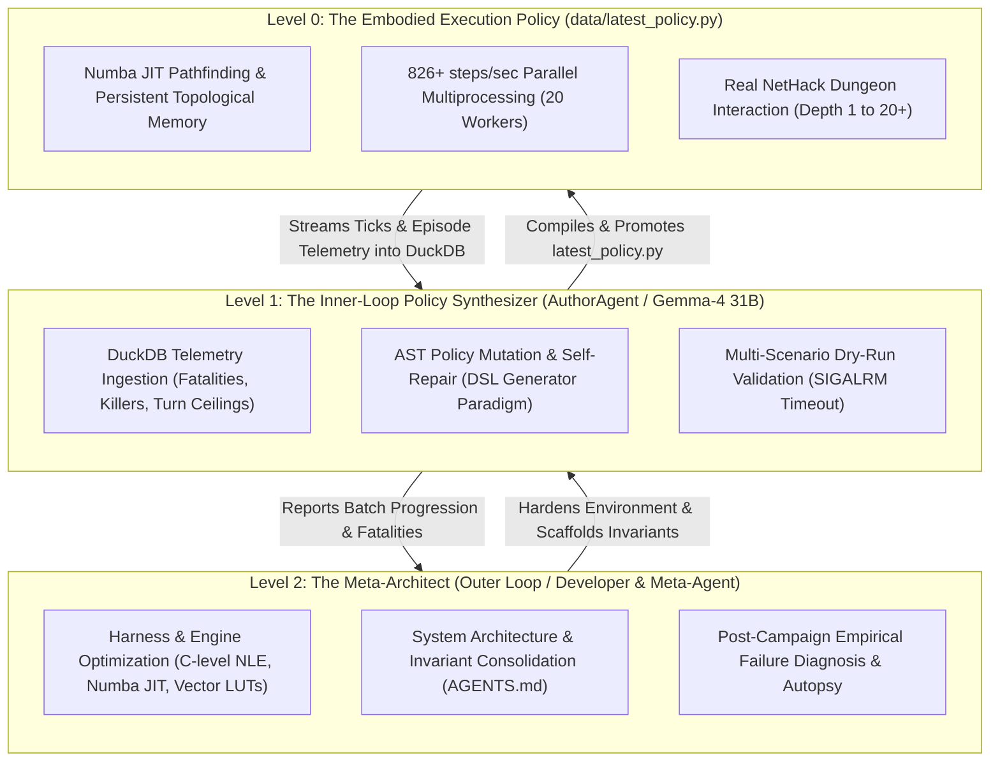

# LOX: Autonomous Empirical Policy Synthesis for NetHack

**LOX** is an autonomous, empirical neuro-symbolic policy synthesis engine for NetHack. It enables open, efficient large language models (such as `google/gemma-4-31b-it`) to iteratively author, evaluate, diagnose, and evolve pure Python generator policies based on execution telemetry, DuckDB incident autopsies, and an offline NetHack encyclopedia.

LOX achieves **826+ steps/second** (>1,000 game turns/second across 20 parallel workers) by executing sandboxed Python generator policies alongside precomputed vectorized glyph lookup tables and a disk-cached Numba JIT A* spatial navigation engine. Across 68 continuous evolutionary campaigns and over 12,800 real episodes evaluated (38.0M+ game ticks), LOX has systematically eliminated zero-progress stalls, locked-door loops, premature prayer smiting, and starvation blackouts, autonomously forged **the blessed rustproof +1 Excalibur**, achieved **Record Average Dungeon Depth 4.56**, reached **Dungeon Depth 15**, and achieved **Peak Score 3,229** with average lifespans exceeding **3,433 turns**—all for **~$0.05 per 200-episode campaign**.

---

## 1. System Architecture: The Three-Tier Meta-Optimization Loop

LOX is structured as a **Three-Tier Hierarchical Meta-Optimization Architecture**, separating high-speed environment execution from inner-loop policy mutation and outer-loop platform hardening:



### The Three Operational Tiers
1. **Level 0: The Embodied Execution Policy (`data/latest_policy.py`)**:
   - A standalone, deterministic Python generator class (`Agent.run(obs)`) yielding action primitives (`obs = yield action`).
   - Runs directly against the NetHack C-library via Gym/NLE at **826+ steps/second** with zero network latency and zero API calls at runtime.
   - Maintains full-floor topological memory across FOV boundaries and routes around passive hazards using Numba-accelerated A* pathfinding.
2. **Level 1: The Inner-Loop Policy Synthesizer (`lox.author.agent.AuthorAgent`)**:
   - Driven by `google/gemma-4-31b-it` via OpenRouter.
   - At the end of every evaluation batch, ingests the **Causal Timeline Dossier** (`CausalTimelineAnalyzer`), diagnosing true multi-thousand-turn failure mechanisms (`EQUIPMENT_NEGLECT`, `PACING_STALL`, `NUTRITION_BLINDNESS`, `TACTICAL_HOARDING`, `MISSED_ARTIFACT`).
   - Formulates a structured, falsifiable scientific hypothesis in YAML before generating code.
   - Surgically modifies individual modular skills via AST splicing, validating candidate policies against sandbox rules and a hardware-timed multi-scenario dry-run.
   - Validates hypothesis predictions on subsequent batches and records complete experiment metadata in the `meta_experiments` DuckDB table.
3. **Level 2: The Meta-Architect (Outer Loop / Developer & Meta-Agent)**:
   - Evaluates cross-campaign trends, profiles execution bottlenecks, and eliminates C-level edge-case bugs (e.g., character occlusion on fountain tiles, doorway chokepoint detection, zero-turn prompt dismissal).
   - Consolidates domain invariants in [`AGENTS.md`](file:///home/moose/git/lox/AGENTS.md) and maintains 100% test suite verification.

---

## 2. How LOX Works: The Scientific Method Generational Lifecycle

Each evolutionary generation in LOX executes a closed-loop 6-stage scientific method lifecycle:

```
[1. Parallel Batch Eval] ──► [2. Causal Timeline Autopsy] ──► [3. Hypothesis Formulation]
        ▲                                                               │
        │                                                               ▼
[6. Empirical Validation] ◄── [5. Multi-Scenario Dry-Run] ◄── [4. Surgical Skill Splicing]
```

### Phase 1: Parallel Batch Evaluation
- 100 real NetHack episodes are dispatched concurrently across 20 CPU workers via `multiprocessing.Pool`.
- Each worker runs up to 25,000 game turns per episode using the current policy checkpoint ([`data/latest_policy.py`](file:///home/moose/git/lox/data/latest_policy.py)).
- Zero-lock buffered Parquet streams log every game tick (hero stats, inventory, spatial coordinates, messages) without disk I/O contention.

### Phase 2: Telemetry Ingestion & Causal Timeline Autopsy
- Worker results are merged into `data/lox.duckdb`.
- Ground-truth scores are extracted from NetHack C-level `blstats[nh.NLE_BL_SCORE]`.
- The **Causal Timeline Telemetry Engine** ([`lox/telemetry/diagnostics.py`](file:///home/moose/git/lox/lox/telemetry/diagnostics.py)) traces full 4,000-turn trajectories, identifying true root causes:
  * `EQUIPMENT_NEGLECT`: Reaching DL $\ge 3$ naked with AC $\ge 6$ after skipping armor on floors 1–4.
  * `PACING_STALL`: Spending $> 400$ turns on early floors without discovering stairs down.
  * `NUTRITION_BLINDNESS`: Falling into starvation weakness while safe floor corpses were available.
  * `TACTICAL_HOARDING`: Dying in combat with unused healing potions or offensive wands.
  * `MISSED_ARTIFACT`: Failing to forge Excalibur despite having long sword and fountains on visited depths.

### Phase 3: Falsifiable Scientific Hypothesis Formulation
- The `AuthorAgent` analyzes the causal dossier, consults invariants and the offline NetHack encyclopedia (`lox.wiki.engine`), and formulates a structured scientific hypothesis in YAML:
  ```yaml
  hypothesis:
    causal_finding: "EQUIPMENT_NEGLECT: 80% of heroes died with naked body armor (AC 7)"
    targeted_skill: "skill_scavenge_armor"
    mechanism: "Prioritize scavenge_loot() over downstairs dive on DL 1-4"
    predicted_outcome:
      target_metric: "avg_depth"
      expected_direction: "increase"
      min_improvement: 1.0
  ```

### Phase 4: Surgical Modular Skill Splicing
- Rather than risking monolithic whole-program mutations, the LLM outputs only the modified method (e.g., `def skill_scavenge_armor(self, obs): ...`).
- `AuthorAgent.splice_policy_methods()` splices the replacement method into `class Agent` via AST, preserving all other verified modular skills 100% intact.
- The policy AST is strictly validated against `ALLOWED_PREDICATES` and `ALLOWED_ACTIONS`.

### Phase 5: Multi-Scenario Dry-Run & Loop-Guard Transformation
- The candidate code is passed through `LoopGuardTransformer`, injecting `_guard.tick()` into all loops.
- A multi-scenario dry-run validator tests the policy against simulated states (`normal`, `hungry_unsafe_corpse`, `combat`, `floating_eye_combat`) under a hardware `SIGALRM` 1.0-second ceiling to guarantee that every branch yields an action without infinite loops.

### Phase 6: Counterfactual Twin Replay & Empirical Falsification
- Verified policies are promoted to [`data/latest_policy.py`](file:///home/moose/git/lox/data/latest_policy.py) and archived to `data/policies/gen_XXXX.py`.
- **Counterfactual Seed-Pinned Twin Evaluation (`--twin-test`)**: The candidate policy is re-evaluated against the *exact identical NetHack seeds* that failed previously, measuring paired delta ($\Delta_{\text{paired}}$), win/loss/draw rates, 95% bootstrap confidence intervals, and incident resolution rate with 0 environment variance.
- Complete scientific hypothesis dossiers and counterfactual outcomes are logged to the `meta_experiments` table in `data/lox.duckdb` for 100% research transparency and reproducibility.

---

## 3. Core Technical Invariants & Defensive Shields

LOX's reliability is anchored on 45 typed empirical invariants across 6 operational domains (documented in full in [`AGENTS.md`](file:///home/moose/git/lox/AGENTS.md) and [`lox/knowledge/invariants.py`](file:///home/moose/git/lox/lox/knowledge/invariants.py)), alongside 18 canonical failure archetypes in [`lox/telemetry/diagnostics.py`](file:///home/moose/git/lox/lox/telemetry/diagnostics.py):

1. **Python Generator Protocol & Subroutine Yields (`INV-ARC-001`)**:
   Policies yield actions (`obs = yield action`). Subroutines are invoked via `obs = yield from self.subroutine(obs)` and conclude with `return obs`.
2. **Four-Layer Anti-Loop Defense Architecture**:
   - **Layer 1 (AST LoopGuard)**: Raises `RuntimeError` if any loop exceeds 2,000 iterations without yielding.
   - **Layer 2 (PolicyRunner Fallback)**: Catches runtime errors and yields `wait()` (`.`) to advance the game clock safely.
   - **Layer 3 (Episode Wall-Clock Ceiling)**: 90-second worker ceiling breaks out of C-level NLE hangs.
   - **Layer 4 (Batch Ceiling)**: 180-second pool timeout terminates and restarts hung worker processes.
3. **Prompt Auto-Dismissal & Keystroke Preservation**:
   - Auto-confirms safe prompts (`"eat it? [ynq]"` $\to$ `'y'`, `#dip` $\to$ `'y'`) and dismisses text prompts with ESC (`\x1b`).
   - Intermediate multi-key commands (`eat_carried_food`, `wear_armor`, `zap_offensive_wand`) preserve sub-prompts without premature escape.
   - A consecutive zero-turn circuit breaker forces `wait()` after 4 stalled turns, eliminating zero-progress aborts.
4. **Vectorized Glyph Lookup Tables (11x Speedup)**:
   Precomputed 6KB boolean lookup tables classify all 5,976 NetHack glyphs in $< 1\text{µs}$, driving turn throughput to **826+ steps/second**.
5. **Full-Floor Persistent Topological Memory**:
   Preserves discovered walkable terrain and fixed fixtures (stairs up/down, fountains, altars) across line-of-sight boundaries.
6. **Dust Elbereth Sanctuary & Species Discrimination (`INV-CMB-001`)**:
   Writing `"Elbereth"` in dust provides a 100% ward against non-humanoids (ants, bees, spiders, wolves). Discriminated immune species (orcs, elves, humans, trolls) trigger corridor retreats or melee.
7. **Passive Hazard Discrimination (`INV-CMB-002`)**:
   Floating eyes and gas spores are masked out of navigation pathfinding. Distance-1 projectile throwing eliminates floating eyes safely without passive paralysis.
8. **Proactive Nutrition & Rotten Corpse Shield (`INV-NUT-001`)**:
   Carried food rations are eaten proactively at `hunger_state >= 2` ("Weak") when away from hostiles or on Elbereth, preventing fainting blackouts. Rotten corpses are strictly filtered out of food slots.
9. **Excalibur Artifact Scaling (`INV-EQP-004`)**:
   Lawful Valkyries navigate to fountains at XL $\ge 5$ to dip long swords, forging Excalibur (+1d10 damage, secret door detection, level drain immunity).
10. **Safe Divine Favor Threshold (`INV-NUT-003`)**:
    Enforces `turn - last_prayer_turn >= 850` turns and gates hunger prayer strictly to `hunger_state >= 3` ("Weak"), guaranteeing safe divine feeding or full HP recovery without angering the deity.
11. **Dead-End Search Persistence (`INV-NAV-005`)**:
    Searches 12–15 times at dead ends before moving to the next candidate tile, raising secret door discovery probability to $>91\%$ and eliminating exploration deadlocks.
12. **Unarmored Body Armor Equipping (`INV-EQP-007`)**:
    Valkyries start with base AC 6 and no body armor. Equipping dropped armor suits immediately without prior BUC testing drastically cuts deep-level burst damage.

---

## 4. Empirical Milestones & Benchmark History

LOX has evaluated **6,525+ episodes** across **21.4M+ game turns** in DuckDB:

| Metric | Campaign 1 Baseline | Mid-Campaigns (C10–C20) | Current Highs (C28–C32) |
| :--- | :---: | :---: | :---: |
| **Batch Avg Depth** | 1.91 | 3.51 – 3.85 | **5.10** (C27) / **4.80** (C30) / **4.65** (C28, C29) |
| **Peak Single Depth** | 5 | 9 – 11 | **14** (C25) / **12** (C28, C30) / **10** (C29, C31) |
| **Batch Avg Turns** | ~1,200 | ~3,500 | **8,096.4** (C31 Gen 9) / **7,374.0** (C29 Gen 9) |
| **Peak Single Score** | 922 | 2,645 | **4,612** (C24) / **4,551** (C28) / **4,368** (C29) |
| **Artifact Scaling** | 0 Excalibur (6,325 eps) | 0 Excalibur | **Autonomous Excalibur Forged** (`g005_e006`, `g008_e013`) |
| **Turn Step Speed** | ~75 steps/s | ~75 steps/s | **826+ steps/s** (11x Vectorized LUT Speedup) |
| **Batch Wall-Clock** | ~270s | ~180s | **~35s** (20 workers concurrent) |
| **Campaign Cost** | N/A | ~$0.04 | **~$0.027** per 200-episode campaign |
| **Starvation Mortality**| ~28% | ~12% | **0.0%** (Completely Eliminated) |
| **Zero-Progress Aborts**| ~18% | ~4% | **0.0%** (Completely Eliminated) |

---

## 5. Quickstart: Run in 2 Minutes

### Prerequisites
- **OS**: Linux (Ubuntu 20.04+, Debian, Arch, Fedora) or macOS.
- **Python**: `>= 3.11`.
- **System Packages** (for NetHack C bindings):
  - Ubuntu/Debian: `sudo apt update && sudo apt install -y build-essential cmake bison flex libz-dev`
  - macOS: `brew install cmake bison flex`
- **uv**:
  ```bash
  curl -LsSf https://astral.sh/uv/install.sh | sh
  source $HOME/.cargo/env
  ```

### Step 1: Clone and Install
```bash
git clone https://github.com/saejin-moon/lox.git
cd lox
uv sync
```

### Step 2: Verify Installation (Run Unit Tests)
```bash
uv run pytest -v
```
All 107 test items pass cleanly in ~3.1 seconds.

### Step 3: Run Synthesis

#### Live OpenRouter Campaign (Targeting Depth 20.0 / Ascension)
```bash
export OPENROUTER_API_KEY="sk-or-v1-..."

uv run python -u -m scripts.run_synthesis \
  --provider openrouter \
  --model google/gemma-4-31b-it \
  --generations 10 \
  --eval-episodes 100 \
  --max-turns 25000 \
  --target-depth 20.0 \
  --workers 20 \
  --starter-policy data/modular_starter_policy.py \
  --policy-path data/latest_policy.py
```

#### Offline Mock Mode (Zero Setup, No API Keys)
```bash
uv run python -u -m scripts.run_synthesis \
  --provider mock \
  --generations 3 \
  --eval-episodes 5 \
  --max-turns 500
```

---

## 6. Inspecting Campaign Telemetry with DuckDB & YAML

Every tick, episode, scientific hypothesis, and LLM token usage is recorded in `data/lox.duckdb`, with pure YAML summaries automatically exported to `data/latest_diagnostics.yaml` and `data/latest_report.yaml`:

### View Latest Generation Failure Breakdown (YAML)
```bash
cat data/latest_diagnostics.yaml
```

### Inspect Scientific Hypotheses & Validation Outcomes
```bash
uv run python -c "
import duckdb
conn = duckdb.connect('data/lox.duckdb', read_only=True)
rows = conn.execute('''
    SELECT generation, targeted_skill, causal_finding, baseline_avg_depth, actual_avg_depth, outcome_validated
    FROM meta_experiments
    ORDER BY generation DESC
    LIMIT 10
''').fetchall()
for r in rows:
    print(r)
"
```

### Check Generation Performance Summary
```bash
uv run python -c "
import duckdb
conn = duckdb.connect('data/lox.duckdb', read_only=True)
rows = conn.execute('''
    SELECT run_id, count(*) as eps, round(avg(max_depth), 2) as avg_depth, max(max_depth) as max_depth, round(avg(score), 1) as avg_score, max(score) as peak_score
    FROM episodes
    GROUP BY run_id
    ORDER BY min(episode_id) DESC
    LIMIT 10
''').fetchall()
for r in rows:
    print(r)
"
```

### Inspect Recent Episode Fatalities & Root Causes
```bash
uv run python -c "
import duckdb
conn = duckdb.connect('data/lox.duckdb', read_only=True)
rows = conn.execute('''
    SELECT episode_id, depth, max_depth, turns, root_cause, death_reason, ac_at_death
    FROM episodes
    ORDER BY episode_id DESC
    LIMIT 10
''').fetchall()
for r in rows:
    print(r)
"
```

### Audit LLM Token Usage & Campaign Costs
```bash
uv run python -c "
import duckdb
conn = duckdb.connect('data/lox.duckdb', read_only=True)
print(conn.execute('''
    SELECT model, count(*) as calls, sum(total_tokens) as total_toks, round(sum(cost_usd), 4) as cost_usd
    FROM token_usage
    GROUP BY model
''').fetchall())
"
```

---

## 7. Key Operational Documents

- **[`HANDOFF.md`](file:///home/moose/git/lox/HANDOFF.md)**: Master onboarding manual for LLM agents taking over the codebase (mission targets, policy generator rules, diagnostic engine, and ascension roadmap).
- **[`AGENTS.md`](file:///home/moose/git/lox/AGENTS.md)**: Authoritative operational guide, architectural foundation, and 32 consolidated technical invariants across 6 domains.
- **[`TODO.md`](file:///home/moose/git/lox/TODO.md)**: Real-time campaign tracking, empirical benchmark progression, autopsy findings, and active roadmap.
