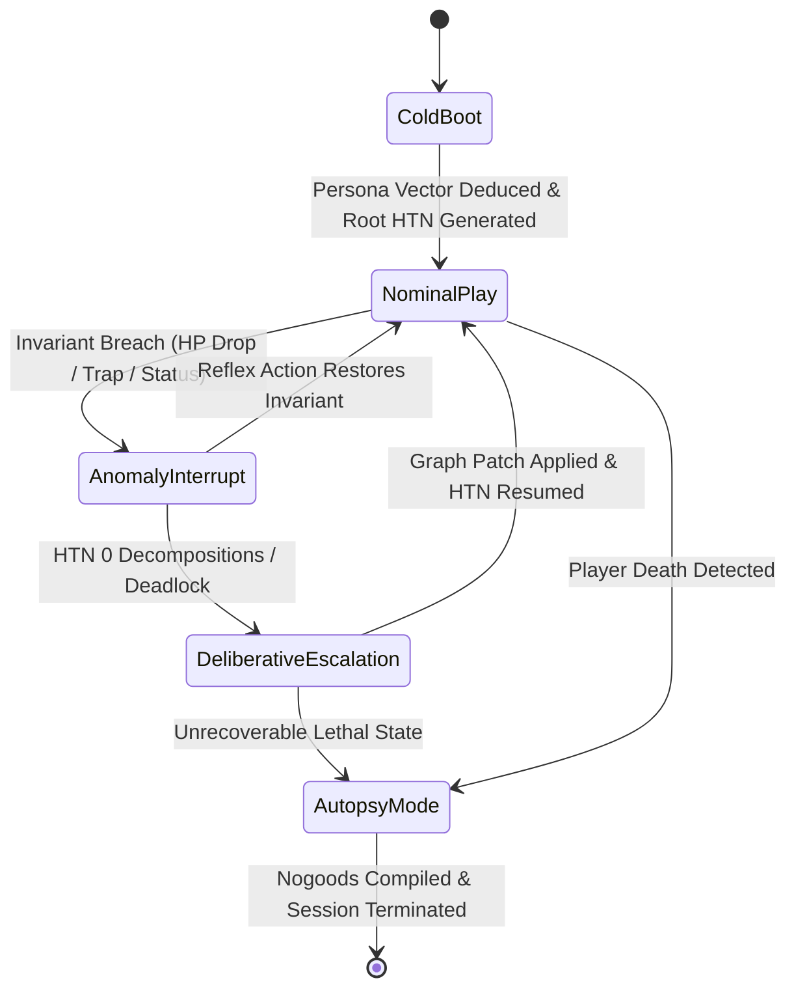

# Specification 00: Master Topology & Data Flow Pipeline

## 1. System Architecture Overview

The system operates as an **Event-Driven Bicameral Neuro-Symbolic Cognitive Operating System**. It completely decouples real-time deterministic execution (Fast Core) from high-latency, multi-step causal reasoning (Slow Deliberative Core).

```
                                 ┌─────────────────────────────────────────┐
                                 │       NetHack C-Engine (NLE / Gym)      │
                                 └────────────────────┬────────────────────┘
                                                      │ Raw Tensors (glyphs, blstats, message)
                                                      ▼
 ┌─────────────────────────────────────────────────────────────────────────────────────────────────┐
 │ SENSORY BOUNDARY & PRE-PROCESSING (Spec 01)                                                     │
 │                                                                                                 │
 │   ┌─────────────────────────────────────────┐     ┌─────────────────────────────────────────┐   │
 │   │   Deterministic Terminal Sanitizer      │────►│        Anomaly Interrupt Engine         │   │
 │   │   - Swallows `--More--` prompts (0 ms)  │     │   - Health deltas (>20% drop)           │   │
 │   │   - Resolves multi-character queries    │     │   - Unseen status (blind, stunned, etc.)│   │
 │   │   - Normalizes dynamic inventory keys   │     │   - 0-progress stalemates (turn counter)│   │
 │   └─────────────────────────────────────────┘     └────────────────────┬────────────────────┘   │
 └────────────────────────────────────────────────────────────────────────┼────────────────────────┘
                                                                          │ Hard Interrupt
                                                                          ▼
 ┌─────────────────────────────────────────────────────────────────────────────────────────────────┐
 │ DUAL-STORE MEMORY ARCHITECTURE (Spec 05)                                                        │
 │                                                                                                 │
 │  ┌──────────────────────────────────────────────┐     ┌──────────────────────────────────────┐  │
 │  │      Immutable Semantic Memory (RAG)         │     │     Evolving Episodic Memory         │  │
 │  │ - Vector (LanceDB) + BM25s NetHack Wiki      │     │ - Cross-generational Nogood Library  │  │
 │  │ - Strict Distance Cutoff (tau >= 0.82)       │     │ - Tuple: <Trigger, Action, Nogood>   │  │
 │  │ - Deterministic SQLite Spoiler Tables        │     │ - CDCL-style HTN pruning rules       │  │
 │  └──────────────────────┬───────────────────────┘     └──────────────────┬───────────────────┘  │
 └─────────────────────────┼────────────────────────────────────────────────┼──────────────────────┘
                           │ Static Physical Laws                           │ Negative Constraints
                           ▼                                                ▼
 ┌─────────────────────────────────────────────────────────────────────────────────────────────────┐
 │ BICAMERAL EXECUTIVE (Spec 03 & 04)                                                              │
 │                                                                                                 │
 │  ┌───────────────────────────────────────────────────────────────────────────────────────────┐  │
 │  │ FAST CORE: Deterministic Hierarchical Task Network (HTN) Planner (Spec 03)                │  │
 │  │ - Sub-millisecond (<0.5 ms) CPU search decomposing Macro-Tasks into primitive sub-tasks   │  │
 │  │ - Verified Preconditions & Invariants (e.g., forbids descending if HP < 50% or Weak)       │  │
 │  │ - Active Pruning: Automatically rejects branches flagged in Episodic Nogood Store         │  │
 │  │ - Autonomous Persona Profiler: Continuous trait vector tunes operators dynamically        │  │
 │  └───────────────────────────────▲───────────────────────────────────────────┬───────────────┘  │
 │                                  │                                           │                  │
 │      Deadlock / Boot / Autopsy   │ Dynamic Task Repair                       │ Dispatched Tasks │
 │                                  │                                           │                  │
 │  ┌───────────────────────────────┴───────────────────────────────────────────┐               │  │
 │  │ SLOW DELIBERATIVE CORE: Out-of-Band Reasoning Engine (Spec 04)            │               │  │
 │  │ - Multi-Provider: OpenRouter, Google Gemma, or local llama.cpp (QwQ-32B)  │               │  │
 │  │ - Dormant during nominal play (0 tokens consumed, 0 ms latency overhead)   │               │  │
 │  │ - <think> Scratchpad: Multi-step causal reasoning & counterfactual search │               │  │
 │  │ - Post-think JSON Parser: Outputs validated HTN graph patches / nogoods   │               │  │
 │  └───────────────────────────────────────────────────────────────────────────┘               │  │
 └──────────────────────────────────────────────────────────────────────────────────────────────┼──┘
                                                                                                │
                                ┌───────────────────────────────────────────────────────────────┘
                                ▼
 ┌─────────────────────────────────────────────────────────────────────────────────────────────────┐
 │ INTERMEDIATE ORCHESTRATION & EPISTEMIC MODELING (Spec 02 & 06)                                  │
 │                                                                                                 │
 │  ┌───────────────────────────────────────────────────────────────────────────────────────────┐  │
 │  │ Epistemic / Bayesian Belief Engine (Spec 02)                                              │  │
 │  │ - Tracks POMDP hidden states: P(Identity), P(BUC), Estimated Charges, Erosion, Alignment  │  │
 │  │ - Bayesian Listeners: Pet movement deltas, altar drops, price ID tables, engrave test logs│  │
 │  │ - Entropy Gate: If entropy(Item) > Threshold, injects mandatory IDENTIFY sub-goal into HTN│  │
 │  └───────────────────────────────┬───────────────────────────────────────────────────────────┘  │
 │                                  │ Validated Operational Directives                             │
 │                                  ▼                                                              │
 │  ┌───────────────────────────────────────────────────────────────────────────────────────────┐  │
 │  │ Domain Managers (Spec 06)                                                                 │  │
 │  │ ├─ Spatial Navigation Manager: Floor frontier exploration, staircase routing, Sokoban A*  │  │
 │  │ ├─ Inventory & Resource Manager: Nutrition monitoring, equipment loadout, prayer cooldowns│  │
 │  │ ├─ Tactical Combat Manager: Threat evaluation, kiting thresholds, ranged spell dispatch   │  │
 │  │ └─ Epistemic Experiment Manager: Schedules non-destructive testing (altar, pet, price)   │  │
 │  └───────────────────────────────┬───────────────────────────────────────────────────────────┘  │
 └──────────────────────────────────┼──────────────────────────────────────────────────────────────┘
                                    │ Low-Level Action Ensembles
                                    ▼
 ┌─────────────────────────────────────────────────────────────────────────────────────────────────┐
 │ WORKER LAYER (Tactical Primitives) (Spec 06)                                                    │
 │                                                                                                 │
 │  ┌───────────────────────────────┐  ┌─────────────────────────────┐  ┌───────────────────────┐  │
 │  │ Jump-Physics / Grid A* Pather │  │   Micro-Combat State Machine│  │  Inventory Primitive  │  │
 │  │ - BFS over known floor terrain│  │   - Tactical retreat/kite   │  │    Action Dispatch    │  │
 │  │ - Path smoothing & trap bypass│  │   - Directional melee hits  │  │  - eat, quaff, wield  │  │
 │  └───────────────────────────────┘  └─────────────────────────────┘  └───────────────────────┘  │
 └──────────────────────────────────┬──────────────────────────────────────────────────────────────┘
                                    │ Atomic Keystrokes ('h', 'j', 'k', 'l', 'e', 'q', ...)
                                    ▼
                        [NetHack Virtual Environment]
```

---

## 2. Timing Budgets & SLA Guarantees

To ensure high gameplay throughput and prevent lag, the execution pipeline enforces strict Service Level Agreements (SLAs) across every layer:

| Subsystem | Latency Target | Hard Deadline | Hardware Execution | Behavior on Breach |
| :--- | :--- | :--- | :--- | :--- |
| **Sensory Boundary (`AutoMoreWrapper`)** | $< 0.02\text{ ms}$ | $0.1\text{ ms}$ | CPU (Python/C) | Drop stale frames, force spacebar flush |
| **Anomaly Sentry (`Invariant Checker`)** | $< 0.05\text{ ms}$ | $0.2\text{ ms}$ | CPU (NumPy/Bitmasks) | Emit default `SIG_ANOMALY_INTERRUPT` |
| **Epistemic Bayesian Update** | $< 0.1\text{ ms}$ | $0.5\text{ ms}$ | CPU (NumPy/SciPy) | Defer exact posterior update to next turn |
| **Fast HTN Graph Search** | $< 0.3\text{ ms}$ | $1.0\text{ ms}$ | CPU (Cython/Python) | Fallback to tactical retreat / wait action |
| **Pathfinding (A* on 80x21 Grid)** | $< 0.2\text{ ms}$ | $0.8\text{ ms}$ | CPU (Cython BFS/A*) | Truncate path to greedy frontier step |
| **Semantic Memory Retrieval (RAG)** | $< 5.0\text{ ms}$ | $15.0\text{ ms}$ | CPU (ONNX / BM25s) | Return `STRICT_NULL` |
| **Deliberative Slow Core (LLM)** | N/A (Out-of-Band) | $8.0\text{ s}$ | Cloud / ML Rig GPU | Fallback to heuristic survival reflex |

---

## 3. System Lifecycle & State Transitions

The cognitive OS transitions between four fundamental operating modes:



1. **Cold Boot (`MODE_INIT`)**:
   - Turn 0 observation ingestion.
   - Persona Profiler inspects attributes, starting inventory, and intrinsics to generate the continuous trait vector.
   - Initial root HTN goal synthesized (`GOAL: SURVIVE_AND_MAP_LEVEL_1`).
2. **Nominal Play (`MODE_FAST_CORE`)**:
   - HTN planner decomposes active macro-tasks into atomic primitives.
   - Worker layer dispatches keystrokes directly into NLE.
   - Zero LLM tokens consumed; execution ticks at 500–2,000 steps per second.
3. **Anomaly Interruption (`MODE_ANOMALY`)**:
   - Triggered by sudden HP loss (>20%), bad status flags (`BLIND`, `CONF`, `STUN`, `HALLU`), or 15-turn spatial lock.
   - Halts active task execution immediately.
   - Fast Core attempts emergency reflex methods (e.g. `RETREAT_TO_CORRIDOR`, `ENGRAVE_ELBERETH`, `QUAFF_FULL_HEALING`).
4. **Deliberative Escalation (`MODE_SLOW_CORE`)**:
   - If emergency reflexes yield zero valid HTN decompositions, the system pauses NLE.
   - The Deliberative Core (OpenRouter / Gemma / llama.cpp QwQ-32B) ingests the 50-step flight recorder, belief matrices, and relevant wiki context.
   - Outputs a validated JSON graph repair patching the HTN.
5. **Autopsy Mode (`MODE_AUTOPSY`)**:
   - On death event (`blstats.hp <= 0` or game over text).
   - Ingests the terminal flight log and runs a causal root-cause analysis.
   - Generates CDCL Nogood clauses ($\langle \text{Trigger}, \text{FatalAction}, \text{DerivedConstraint} \rangle$) and commits them to the persistent episodic memory store.

---

## 4. AutoAscend Architectural Gap Analysis

AutoAscend (Sypetkowski et al., 2021) is the current state-of-the-art agent for the NetHack Learning Environment. Below is a systematic architectural comparison demonstrating why this Neuro-Symbolic Cognitive OS is structured to surpass it:

| Dimension | AutoAscend (Baseline) | Neuro-Symbolic Cognitive OS (Our Architecture) |
| :--- | :--- | :--- |
| **Control Paradigm** | Monolithic rule-based priority queue of handcoded strategies. | **Bicameral Executive**: Hierarchical Task Network (Fast Core) + Out-of-Band Causal LLM (Slow Core). |
| **State Estimation (POMDP)** | Ad-hoc heuristic flags; treats most unknown items as untrusted or guesses based on raw cost. | **Rigorous Bayesian Belief Engine**: Probability distributions over Identity, BUC, Charges, and Erosion with active entropy reduction. |
| **Cross-Generational Learning** | **Zero**. Every run starts tabula rasa; repeats the exact same fatal mistake every single game. | **CDCL Nogood Store**: Death autopsies compile permanent negative constraints that actively prune fatal HTN branches across generations. |
| **Knowledge Base** | Hardcoded Python lookup tables and rules embedded directly in code. | **Immutable Semantic Memory (RAG)**: Full NetHack Wiki indexed via `bm25s` + `FastEmbed` with a **Strict-Null guarantee** ($\tau \ge 0.82$). |
| **Deadlock & Oscillation Recovery** | Crude turn counters; often loops between two tiles or oscillates until starvation. | **Anomaly Sentry & Deliberative Core**: Trapped states trigger causal reasoning to synthesize novel graph repair patches. |
| **Role Adaptability** | Engineered almost exclusively around the Lawful Dwarf Valkyrie; brittle on other archetypes. | **Strictly Role-Agnostic Core**: Persona Profiler deduces continuous trait vectors; supports dual evaluation (`RANDOM_GENERALIST` and `COMPETENCE_SELECTION`). |
| **Safety Interlocks** | Static `if/else` checks scattered across strategy classes. | **Entropy Safe-Gates**: Actions like `EQUIP` or `QUAFF` are mathematically blocked if Shannon entropy $\mathcal{H}(B(i)) > \tau_{\text{safe}}$. |

---

## 5. Persona Profiler & Dual Operating Modes

To guarantee that the system never relies on hardcoded role-specific branching, all role specialization is handled via continuous traits:

### The Continuous Trait Vector
$$\vec{\theta}_{\text{persona}} = \langle T_{\text{resilience}}, T_{\text{ranged}}, T_{\text{mana}}, T_{\text{stealth}}, T_{\text{alignment\_strictness}} \rangle \in [0, 1]^5$$

* $T_{\text{resilience}}$: Computed from base HP, AC, strength, and physical constitution. Governs melee engagement risk tolerance.
* $T_{\text{ranged}}$: Computed from starting missile weapons, dexterity, and launcher skills. Governs preferred kiting distance.
* $T_{\text{mana}}$: Computed from energy pool, intelligence, wisdom, and known spells. Governs magic vs physical resource allocation.
* $T_{\text{stealth}}$: Computed from starting speed, stealth intrinsics, and armor weight.
* $T_{\text{alignment\_strictness}}$: Derived from character alignment (Lawful vs Neutral vs Chaotic), controlling altar conversion and prayer thresholds.

### Dual Operating & Evaluation Modes
1. **`MODE_RANDOM_GENERALIST`**:
   - Used for broad benchmark evaluation.
   - Game initializes with random role, race, gender, and alignment.
   - Tests pure zero-shot adaptability under high initial entropy.
2. **`MODE_COMPETENCE_SELECTION`**:
   - Used for ascension maximization.
   - **Phase 1 (Stratified Sampling)**: Evaluates performance across diverse archetype clusters.
   - **Phase 2 (Empirical Competence Matrix)**: Tracks survival depth, turns, and Nogood density.
   - **Phase 3 (Optimal Deployment)**: Autonomously selects the role and trait configuration with the highest empirical victory probability given the current Nogood library.

---

## 6. Bottlenecks, Design Formalizations & Fatal Flaws Resolution
For deep technical mitigation strategies on process-level concurrency, hash-gated inventory ingestion, inverted Nogood trie indexing, multi-step micro-action fibers, the canonical 64-bit state predicate registry, and NetHack instant-death safety interlocks (cockatrice petrification, shopkeeper anger, wand reflections), refer to [09_bottlenecks_edge_cases_and_flaws.md](file:///home/bae/corp/docs/architecture/09_bottlenecks_edge_cases_and_flaws.md).

---

## 7. Native Rust Acceleration Boundary ("Python Brain, Rust Spine")
To execute up to 25,000 FPS and compress 1,000-game benchmark suites from 12+ hours to under 25 minutes, the high-frequency inner loops (80x21 grid A* pathfinding, Dijkstra distance transform fields, and single-cycle CDCL Nogood bitmask cuts) are accelerated via a compiled Rust native extension (`lox_core` via `PyO3` and `maturin`). Full Rust struct layouts and zero-copy FFI contracts are specified in [10_rust_acceleration_and_pyo3_bindings.md](file:///home/bae/corp/docs/architecture/10_rust_acceleration_and_pyo3_bindings.md).
