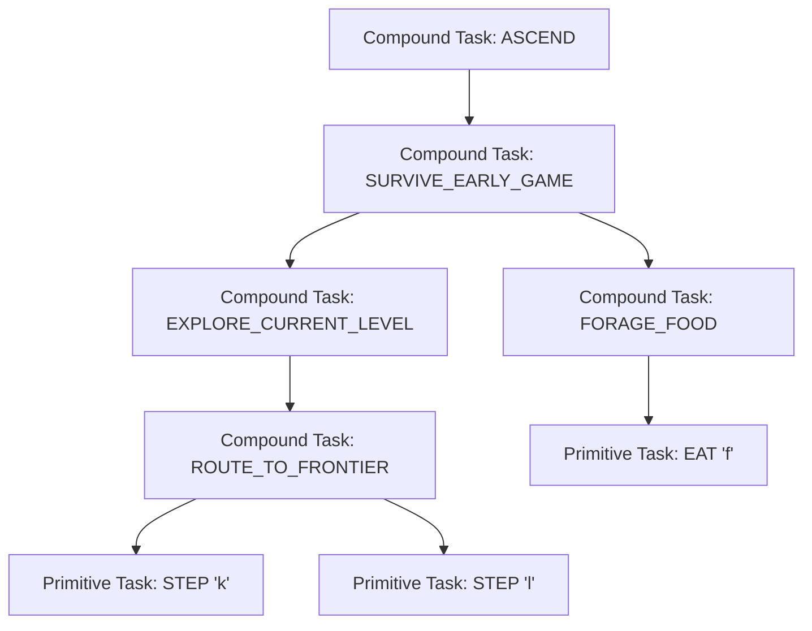

# Specification 03: Fast Core HTN Planner

## 1. Formal HTN Planning Grammar

The Fast Core planner is formalized as a Hierarchical Task Network:
$$\mathcal{H} = \langle \mathcal{S}, \mathcal{T}_P, \mathcal{T}_C, \mathcal{M}, \mathcal{O}, \mathcal{C}_{\text{nogood}} \rangle$$

* $\mathcal{S}$: The unified world state (spatial map, normalized inventory, belief states $B(i)$, bottom-line stats).
* $\mathcal{T}_P$: Set of **Primitive Tasks** that map 1:1 to executable worker commands (e.g., `STEP(dir)`, `APPLY(slot)`).
* $\mathcal{T}_C$: Set of **Compound Tasks** that represent high-level strategic objectives (e.g., `EXPLORE_LEVEL`, `FORAGE_FOOD`).
* $\mathcal{M}$: Set of **Methods** $m = \langle \text{task}(m), \text{preconditions}(m), \text{subtasks}(m) \rangle$ that decompose a compound task into an ordered sequence of sub-tasks.
* $\mathcal{O}$: Set of **Operators** defining the state transition function $S' = \mathcal{O}(S, t_p)$ for primitive tasks.
* $\mathcal{C}_{\text{nogood}}$: Set of active negative constraints compiled from episodic memory.



---

## 2. Dynamic Persona Profiler

The planner is strictly **role-agnostic**. It does not branch on string role names (e.g. `if role == "Tourist"`). Instead, at Turn 0, it derives a continuous 5-dimensional **Persona Trait Vector**:

$$\vec{\theta} = \langle T_{\text{resilience}}, T_{\text{ranged}}, T_{\text{mana}}, T_{\text{stealth}}, T_{\text{alignment}} \rangle \in [0, 1]^5$$

### Mathematical Derivation of Traits
1. **Resilience ($T_{\text{resilience}}$)**:
   $$T_{\text{resilience}} = \sigma \left( \frac{\text{BaseHP} - 12}{4} + \frac{\text{Con} - 12}{3} + \frac{10 - \text{AC}}{2} \right)$$
   * High ($>0.7$): Prefers aggressive hallway melee, willing to take trades.
   * Low ($<0.4$): Enforces strict 2-tile kiting buffer; avoids close combat without chokepoints.
2. **Ranged Affinity ($T_{\text{ranged}}$)**:
   $$T_{\text{ranged}} = \sigma \left( \frac{\text{Dex} - 12}{3} + 2.0 \cdot \mathbb{I}(\text{LauncherEquipped}) + 0.5 \cdot \text{Count}(\text{Daggers}) \right)$$
   * Scales the utility of ranged firing tasks over closing distance.
3. **Mana Pool ($T_{\text{mana}}$)**:
   $$T_{\text{mana}} = \sigma \left( \frac{\text{MaxEnergy} - 5}{5} + \frac{\text{Int} + \text{Wis} - 24}{6} \right)$$
   * Directs spellcasting frequency and rest thresholds for energy regeneration.
4. **Stealth & Evasion ($T_{\text{stealth}}$)**:
   $$T_{\text{stealth}} = \sigma \left( \frac{\text{Dex} - 12}{4} - \frac{\text{ArmorWeight}}{100} + 1.5 \cdot \mathbb{I}(\text{StealthIntrinsic}) \right)$$
   * Dictates whether the agent wakes sleeping monsters or sneaks past lethal threats.
5. **Alignment Strictness ($T_{\text{alignment}}$)**:
   * Lawful: Strict altar co-alignment; avoids unaligned shops and peaceful monster aggression.
   * Chaotic: Aggressive altar conversion; opportunistic peaceful sacrifices.

---

## 3. Precondition Evaluators & Invariant Guards

Methods are guarded by verified logical functions. A method cannot decompose unless all preconditions evaluate to `True`.

### Standard Guard Rules

```python
class HTNGuards:
    @staticmethod
    def can_descend(state: UnifiedState) -> bool:
        """Forbids descending staircase into deeper dungeon if unstable."""
        if state.blstats.hp < int(state.blstats.max_hp * 0.50):
            return False
        if state.blstats.hunger_state >= 3:  # Weak or fainting
            return False
        if state.blstats.depth >= 8 and not state.intrinsics.poison_resistance:
            # Poison instakills become frequent at dlvl 8+
            return False
        return True

    @staticmethod
    def can_pray(state: UnifiedState) -> bool:
        """
        NetHack 3.6.6 Prayer Safety Model:
        - Turn 0 initial ublesscnt is 300 (Turn 301 nominal, Turn 101 in major trouble).
        - Subsequent prayers reset timeout via rnz(350): mean = 454 turns, std = 365 turns.
        - Praying while timeout > 0 causes divine wrath, -3 luck, and smiting!
        """
        if state.estimated_luck < 0:
            return False
        
        turns_since_prayer = state.blstats.turn - state.last_prayer_turn
        is_first_prayer = (state.last_prayer_turn == 0)

        # Major emergency threshold (HP <= 5 or Fainting): timeout safe up to 200
        is_major_emergency = (state.blstats.hp <= 5 or state.blstats.hunger_state >= 4)
        if is_major_emergency:
            required_turns = 101 if is_first_prayer else 450
            return turns_since_prayer >= required_turns

        # Conservative autonomous threshold for routine favors: mu + 1.1*sigma
        required_turns = 301 if is_first_prayer else 850
        return turns_since_prayer >= required_turns

    @staticmethod
    def safe_to_eat(state: UnifiedState, corpse: FloorItem) -> bool:
        """
        NetHack 3.6.6 Food Safety Model:
        - Lichen & lizard never rot and are safe indefinitely.
        - Acid blobs never cause food poisoning.
        - General corpses: rottenness = age / random(10, 29) (+2 if cursed).
          rottenness >= 6 causes fatal food poisoning (death in 10-19 turns).
          Safe consumption threshold: age <= 25 turns.
        """
        if corpse.monster_type in ("lichen", "lizard"):
            return True     # Immortal comestibles: never rot
        if corpse.monster_type in ("cockatrice", "chickatrice", "medusa"):
            return False    # Instant petrification
        if corpse.monster_type == "green slime":
            return False    # Fatal slime metamorphosis
        if corpse.is_poisonous and not state.intrinsics.poison_resistance:
            return False    # Fatal poison roll
        if corpse.is_same_race(state.player_race):
            return False    # Cannibalism (luck penalty + telepathy loss)

        corpse_age = state.blstats.turn - corpse.drop_turn
        # Conservative cutoff: prevents reaching rottenness >= 4 or >= 6 during multi-turn eating
        if corpse_age > 25:
            return False
        return True
```

---

## 4. Active CDCL Nogood Branch Pruning

During HTN decomposition, every candidate method branch is checked against the active Nogood Store **before** recursive expansion:

```
Algorithm 1: Nogood-Pruned HTN Decomposition
Input: State S, Task T, NogoodStore N
Output: Ordered Plan of Primitive Tasks or DEADLOCK

function DECOMPOSE(S, T, depth):
    if depth > MAX_DEPTH then return DEADLOCK
    
    if IS_PRIMITIVE(T) then
        if N.VIOLATES_NOGOOD(S, T) then
            return PRUNED_BRANCH
        end if
        return [T]
    end if
    
    methods = GET_MATCHING_METHODS(T)
    SORT_BY_PERSONA_UTILITY(methods, S.persona_vector)
    
    for each method in methods do
        if not EVALUATE_PRECONDITIONS(method, S) then
            continue
        end if
        
        # Check candidate against Nogood library
        if N.MATCHES_TRIGGER(S, method) then
            LOG_PRUNED_SUBTREE(method)
            continue
        end if
        
        subplan = []
        S_sim = S.CLONE()
        success = True
        
        for each subtask in method.subtasks do
            step_plan = DECOMPOSE(S_sim, subtask, depth + 1)
            if step_plan == DEADLOCK or step_plan == PRUNED_BRANCH then
                success = False
                break
            end if
            subplan.APPEND(step_plan)
        end for
        
        if success then return subplan
    end for
    
    return DEADLOCK
```

### Nogood Violation Check Complexity
Because Nogoods are compiled into integer bitmasks over atomic state predicates (e.g. `adjacent_to_floating_eye == True`, `ranged_equipped == False`), evaluating `N.VIOLATES_NOGOOD(S, T)` takes **$< 1\text{ microsecond}$** ($O(1)$ bitwise AND operations), maintaining our strict $<0.5\text{ ms}$ tick SLA.

---

## 5. Cycle Detection & Deliberative Escalation

To guarantee the agent never enters infinite oscillation loops (a notorious AutoAscend flaw), the planner maintains an oscillation ring buffer:

```python
@dataclass
class PlanSignature:
    task_name: str
    target_pos: tuple[int, int]
    turn: int

class CycleDetector:
    def __init__(self, window_size: int = 10, max_repetitions: int = 3):
        self.history: list[PlanSignature] = []
        self.window_size = window_size
        self.max_repetitions = max_repetitions

    def record_and_check(self, signature: PlanSignature) -> bool:
        self.history.append(signature)
        if len(self.history) > self.window_size:
            self.history.pop(0)

        # Count identical (task_name, target_pos) occurrences in window
        matches = [s for s in self.history if s.task_name == signature.task_name and s.target_pos == signature.target_pos]
        if len(matches) >= self.max_repetitions:
            return True  # Cycle detected!
        return False
```

### Escalation Trigger
If:
1. `CycleDetector.record_and_check()` returns `True`, OR
2. `DECOMPOSE()` returns `DEADLOCK` (0 valid decomposition paths from current state),
The Fast Core halts, raises `HTN_DEADLOCK_EXCEPTION`, and passes control to the **Deliberative LLM Core (Spec 04)** for causal graph repair.
