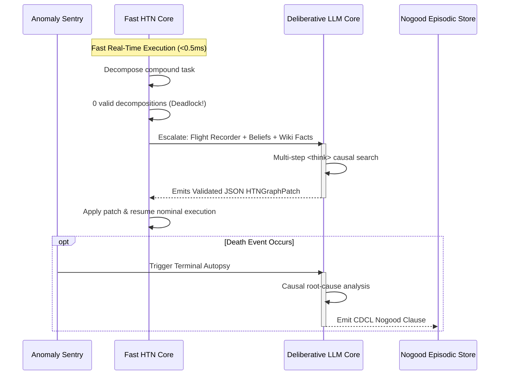

# Specification 04: Slow Core Deliberative LLM Engine

## 1. Role & Execution Protocol

The Deliberative LLM Core acts as the "System 2" cognitive layer. Unlike traditional end-to-end LLM game agents that query a language model on every frame (incurring prohibitive latency and token costs), this Deliberative Core is **strictly dormant during nominal play**:
* **Nominal Latency Overhead**: $0\text{ ms}$.
* **Nominal Token Cost**: $0\text{ tokens}$.

It is triggered exclusively under three discrete circumstances:
1. **Cold Boot (`PHASE_BOOT`)**: Synthesizes the initial HTN macro-strategy based on the deduced Persona Trait Vector.
2. **Anomaly Deadlock (`PHASE_DEADLOCK`)**: When the Fast Core HTN planner encounters a spatial or tactical cycle, or evaluates 0 valid decompositions.
3. **Fatal Autopsy (`PHASE_AUTOPSY`)**: Post-mortem analysis triggered upon agent death to extract cross-generational CDCL Nogood clauses.



---

## 2. Multi-Provider LLM Abstraction Layer

The engine abstracts all LLM calls behind a unified, lightweight interface. The active backend is selected via configuration without touching higher-level logic:

```python
from abc import ABC, abstractmethod
from pydantic import BaseModel
from typing import Any

class LLMResponse(BaseModel):
    thinking_content: str
    structured_data: dict[str, Any]
    tokens_consumed: int
    latency_ms: float

class LLMProvider(ABC):
    @abstractmethod
    async def generate_reasoning_and_json(
        self, 
        system_prompt: str, 
        user_context: str,
        json_schema: type[BaseModel]
    ) -> LLMResponse:
        """
        Executes out-of-band reasoning, extracting free-form text inside <think>...</think>
        and strictly parsing the post-think JSON payload into json_schema.
        """
        pass
```

### Supported Providers

#### 1. `OpenRouterProvider` (Cloud Development)
* **Endpoint**: `https://openrouter.ai/api/v1/chat/completions`
* **Target Models**: Free tier reasoning models (e.g., `deepseek/deepseek-r1:free`, `qwen/qwen-2.5-coder-32b-instruct:free`).
* **Implementation**: Utilizes standard `openai.AsyncOpenAI` client pointing to `base_url="https://openrouter.ai/api/v1"`.

#### 2. `GemmaRouteProvider` (Google Free Tier)
* **Endpoint**: Google AI Studio / Gemma REST route.
* **Target Models**: `gemma-4-it` or `gemini-1.5-flash` free route.
* **Implementation**: Uses lightweight `httpx.AsyncClient` with standard API key authentication.

#### 3. `LlamaCppProvider` (Local ML Rig / Production)
* **Endpoint**: Local server instance `http://localhost:8080/v1/chat/completions`.
* **Target Model**: **`QwQ-32B`** (or Qwen-2.5-32B-Instruct) quantized in GGUF/AWQ 4-bit, served via `llama-server`.
* **Zero Cloud Latency**: 100% offline, zero network egress, fully deterministic temperature ($T=0.0$).

---

## 3. `<think>` Scratchpad & Structured Output Protocol

To eliminate hallucinations while preserving chain-of-thought capabilities, all queries follow a dual-phase output format:
1. **Unconstrained Causal Scratchpad**: The model explores hypotheses, environmental dynamics, and spoiler mechanics within `<think>...</think>` tags.
2. **Strictly Typed JSON**: Directly following `</think>`, the model outputs a single JSON code block validated against a Pydantic schema.

### Pydantic Schemas

#### A. Plan Repair Schema (`HTNGraphPatch`)
Used during Anomaly Deadlock to patch the active HTN task tree:

```python
from pydantic import BaseModel, Field

class SubTaskSpec(BaseModel):
    task_name: str = Field(description="Name of primitive or compound task")
    target_slot: str | None = Field(None, description="Inventory letter UID if applicable")
    target_direction: str | None = Field(None, description="Direction key: h,j,k,l,y,u,b,n")
    target_coordinate: tuple[int, int] | None = Field(None, description="(x, y) map position")

class HTNGraphPatch(BaseModel):
    deadlock_cause: str = Field(description="Causal summary of why HTN failed to decompose")
    confidence: float = Field(ge=0.0, le=1.0)
    abandon_current_macro: bool = Field(description="Whether to purge active compound goal")
    injected_subtasks: list[SubTaskSpec] = Field(description="Ordered sequence of tasks to execute")
    new_invariants: list[str] = Field(description="Guard conditions that must hold")
```

#### B. Autopsy & Nogood Schema (`AutopsyReport`)
Used upon death to synthesize a CDCL Nogood clause:

```python
class NogoodClause(BaseModel):
    trigger_predicates: dict[str, Any] = Field(
        description="Boolean state conditions that characterize the trap (e.g. adjacent_monster, hp_pct)"
    )
    fatal_action: str = Field(description="The exact primitive action that caused fatal damage")
    derived_constraint: str = Field(description="The negative rule to compile into HTN branch guards")

class AutopsyReport(BaseModel):
    death_cause: str = Field(description="Official game over reason")
    lethal_turn: int = Field(description="Game turn where fatal damage was received")
    causal_chain: list[str] = Field(description="Multi-step progression leading to death")
    counterfactual_fix: str = Field(description="What action would have preserved survival")
    nogood: NogoodClause = Field(description="Compiled negative constraint for episodic memory")
```

---

## 4. Context Assembly Pipeline

When triggering the Deliberative Core, the context builder constructs a compact, high-density prompt buffer:

```
┌─────────────────────────────────────────────────────────────────┐
│                       CONTEXT PROMPT BUFFER                     │
├─────────────────────────────────────────────────────────────────┤
│ 1. Current Persona Trait Vector:                                │
│    Resilience: 0.85 | Ranged: 0.20 | Mana: 0.10 | Stealth: 0.30│
│                                                                 │
│ 2. Bottom-Line Status (blstats):                                │
│    HP: 4/18 | AC: 6 | Depth: 3 | Turn: 482 | Hunger: Hungry    │
│                                                                 │
│ 3. Epistemic Belief Inventory:                                  │
│    - Slot 'a': +1 short sword (B: 0.05, U: 0.95, C: 0.00)       │
│    - Slot 'b': bubbly potion (Candidates: Extra Healing, Sleep) │
│                                                                 │
│ 4. Nearby Spatial Grid (9x9 around player):                     │
│    # # # # # # # # #                                            │
│    # . . . . . . . #    e = floating eye (adjacent at East)     │
│    # . . @ e . . . #    @ = player                              │
│                                                                 │
│ 5. Flight Recorder Delta Log (Last 10 turns):                   │
│    Turn 478: Step East -> Turn 479: Missed attack -> ...        │
│                                                                 │
│ 6. Retrieved Immutable Wiki Rules (Strict-Null RAG):            │
│    - "Attacking a floating eye in melee causes instant paralysis"│
└─────────────────────────────────────────────────────────────────┘
```

---

## 5. Fault Tolerance, Resilient Parsing & Timeouts

Because external API calls can fail or lag, the Deliberative Core enforces strict safety interlocks:

1. **Hard Timeout ($8.0\text{ s}$)**:
   - If the provider does not return within 8 seconds, the request is cancelled.
2. **Resilient JSON Parsing with `json-repair`**:
   - Post-think JSON output is cleaned using `json-repair` before Pydantic parsing. This automatically remedies unclosed brackets, missing quotes, and trailing commas frequently emitted by smaller 32B models.
3. **Deterministic Survival Fallback**:
   - If the LLM call times out or emits unparseable JSON, the Fast Core triggers a hardcoded fallback reflex:
     * If adjacent to high-threat monster: `TASK: RETREAT_TO_SAFETY` or `TASK: ENGRAVE_DUST("Elbereth")`.
     * Else: `TASK: WAIT_FOR_RECOVERY`.
