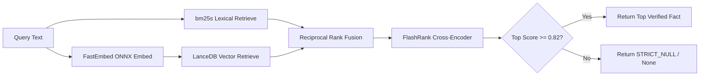

# Specification 05: Dual-Store Memory Architecture & RAG

## 1. Dual-Store Architecture Overview

To balance immutable game physics against dynamic evolutionary learning across runs, the cognitive OS separates knowledge into two independent stores:

```
┌─────────────────────────────────────────────────────────────────────────────────────────────┐
│                                DUAL-STORE MEMORY ARCHITECTURE                                │
├─────────────────────────────────────────────────────────┬───────────────────────────────────┤
│ 1. IMMUTABLE SEMANTIC MEMORY                            │ 2. EVOLVING EPISODIC MEMORY       │
│ - Offline ingested NetHack Wiki XML dump                │ - Cross-generational CDCL Nogoods │
│ - Static SQLite deterministic lookup tables             │ - Negative constraint bitmasks    │
│ - Hybrid BM25s + LanceDB vector store                   │ - Causal autopsy telemetry        │
│ - Strict-Null cross-encoder reranker (tau >= 0.82)      │ - Permanent branch pruning rules  │
└─────────────────────────────────────────────────────────┴───────────────────────────────────┘
```

---

## 2. Offline Semantic Ingestion & ETL Pipeline

The Semantic Store is built completely **offline** to ensure zero runtime ingestion overhead:

```
NetHackWiki XML Dump (nethackwiki_current.xml.gz)
         │
         ▼
[ETL Parser: mwparserfromhell + wikitextparser]
         │
         ├──────────────────────────────────────────┬─────────────────────────────────┐
         ▼                                          ▼                                 ▼
[Deterministic Structured Tables]         [Lexical Chunks]                  [Embedding Vectors]
         │                                          │                                 │
         ▼                                          ▼                                 ▼
  SQLite Database                            bm25s Index                       LanceDB Table
  (Prices, Monsters, Wands)                  (SciPy Sparse)                    (bge-small-en ONNX)
```

### ETL Extraction Strategy
1. **Source Archive**: `https://archive.alt.org/nethackwiki/nethackwiki_current.xml.gz` (~20 MB compressed, ~150 MB uncompressed).
2. **Filtering**: Stream XML elements using Python's `xml.etree.ElementTree.iterparse()`. Skip namespaces (`Talk:`, `User:`, `File:`, `Template:`).
3. **Extraction Targets**:
   - **Deterministic Tables**:
     * `shop_prices`: Base price, buy/sell formulas per item class.
     * `wand_engravings`: Exact message string $\to$ candidate wand identities.
     * `monster_mechanics`: Speed, AC, MR, resistances, special attacks (paralysis, petrification, drain).
   - **Unstructured Chunks**: Strategy guides, dungeon branch walkthroughs, spoiler interactions.

---

## 3. Hybrid Lexical + Vector Retrieval with Strict-Null

During runtime, unstructured knowledge queries (e.g., *"How do I defeat Medusa without a mirror?"*) pass through a hybrid retrieval pipeline designed to evaluate in $<15\text{ ms}$ on CPU:



### 1. BM25 Lexical Engine (`bm25s`)
* Lexical exact-match search is essential for NetHack's arcane terminology (`"Elbereth"`, `"PYEC"`, `"wand of death"`).
* `bm25s` precalculates vocabulary term weights into SciPy sparse matrices at index time, executing queries across 20,000 wiki passages in **$<0.2\text{ ms}$**.

### 2. Dense Vector Search (`LanceDB` + `FastEmbed`)
* **Embedding Model**: `BAAI/bge-small-en-v1.5` (384 dimensions) executed via quantized ONNX on CPU.
* **Storage**: Embedded serverless `LanceDB` dataset using Apache Arrow columnar disk format.
* **Execution Time**: ~2–4 ms for query vectorization; <1 ms for vector nearest-neighbor search.

### 3. FlashRank Strict-Null Reranker
* **Model**: `ms-marco-TinyBERT-L-2-v2` cross-encoder running via CPU ONNX.
* **Strict-Null Contract**:
  $$\text{Score}(q, d) = \sigma(\text{CrossEncoder}(q, d))$$
  $$\text{Result} = \begin{cases} d_{\text{top}}, & \text{if } \text{Score}(q, d_{\text{top}}) \ge 0.82 \\ \text{NULL}, & \text{otherwise} \end{cases}$$
  If the top retrieved score is below 0.82, the pipeline returns programmatic `None`. This guarantees the deliberative LLM core receives verified wiki facts rather than speculative noise.

---

## 4. Evolving Episodic Memory (CDCL Nogood Store)

The Episodic Memory store records negative operational knowledge learned through death autopsies, structured on the principles of Conflict-Driven Clause Learning (CDCL) from SAT solvers:

### Nogood Clause Specification
A Nogood $C_k$ represents a state-action combination that is mathematically guaranteed to result in fatal damage or catastrophic loss:

$$C_k = \langle \vec{\Phi}_{\text{trigger}}, a_{\text{fatal}}, \Psi_{\text{constraint}} \rangle$$

* $\vec{\Phi}_{\text{trigger}}$: Set of boolean state predicates that activate the nogood.
* $a_{\text{fatal}}$: The forbidden primitive action or method.
* $\Psi_{\text{constraint}}$: The derived constraint injected into HTN guards.

```python
from dataclasses import dataclass
from typing import Any

@dataclass(slots=True, frozen=True)
class NogoodEntry:
    nogood_id: str
    generation_learned: int
    trigger_predicates: dict[str, Any]
    fatal_action: str
    derived_constraint: str
    hit_count: int = 0
```

### Concrete Nogood Examples

```json
[
  {
    "nogood_id": "NG-001-FLOATING-EYE-MELEE",
    "generation_learned": 4,
    "trigger_predicates": {
      "adjacent_monster": "floating eye",
      "ranged_weapon_equipped": false,
      "player_blind": false
    },
    "fatal_action": "MELEE_ATTACK(direction)",
    "derived_constraint": "FORBID: MELEE_ATTACK where target == 'floating eye' and not blind"
  },
  {
    "nogood_id": "NG-002-COCKATRICE-GLOVELESS",
    "generation_learned": 9,
    "trigger_predicates": {
      "target_item": "cockatrice corpse",
      "gloves_equipped": false
    },
    "fatal_action": "PICKUP(target_item)",
    "derived_constraint": "FORBID: PICKUP where target == 'cockatrice corpse' and not gloves_equipped"
  },
  {
    "nogood_id": "NG-003-EAT-TAINTED-CORPSE",
    "generation_learned": 14,
    "trigger_predicates": {
      "corpse_turns_old": "> 50",
      "corpse_type": "organic_non_lichen"
    },
    "fatal_action": "EAT(corpse)",
    "derived_constraint": "FORBID: EAT where age > 50 and type != 'lichen'"
  }
]
```

---

## 5. Nogood Compilation & Runtime Evaluation

To eliminate Python evaluation overhead during nominal game ticks, Nogoods are compiled into a binary lookup index:

1. **Predicate Bitmask Registration**:
   Every recurring state predicate (e.g. `adjacent_floating_eye`, `hp_critical`, `is_uncursed`) is assigned a static bit index $b_j \in [0, 63]$.
2. **Runtime Bitwise Check**:
   On every candidate HTN method evaluation, the Fast Core constructs the active state bitmask:
   $$M_{\text{state}} = \sum_{j} \mathbb{I}(\text{Predicate}_j(S)) \cdot 2^j$$
   A candidate action is rejected in **$<1\text{ microsecond}$** if:
   $$(M_{\text{state}} \ \& \ M_{\text{trigger}, k}) == M_{\text{trigger}, k} \quad \forall k \in \text{Nogoods}(a)$$
3. **Cross-Run Persistence**:
   Nogoods are persisted to `data/episodic_nogoods.jsonl` and loaded at agent boot, ensuring the system never repeats a fatal mistake across its entire lifespan.
