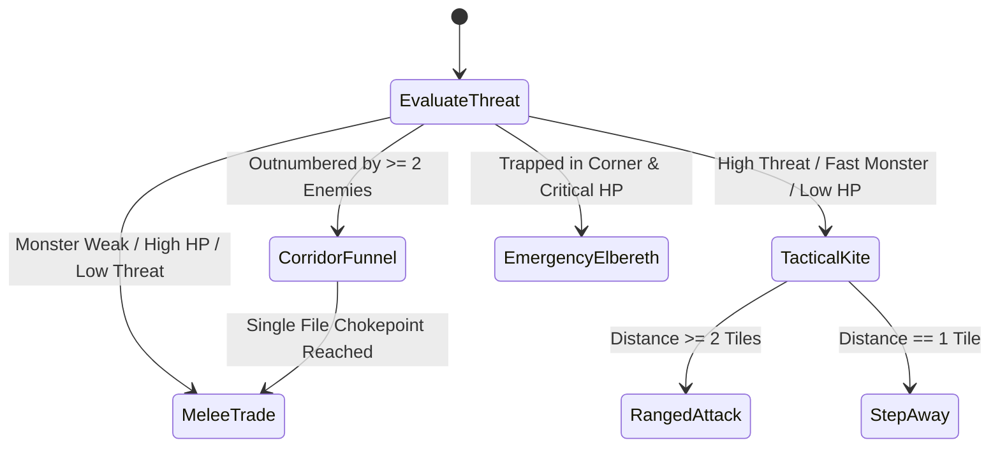

# Specification 06: Domain Managers & Tactical Worker Layer

## 1. Role of Intermediate Domain Managers

The Intermediate Orchestration Layer translates abstract goals from the Fast HTN Core into concrete, hazard-aware operational directives. It consists of four specialized domain managers:

```
                      Fast HTN Core
                            │
            ┌───────────────┼───────────────┬────────────────┐
            ▼               ▼               ▼                ▼
    [Spatial Nav]   [Tactical Combat]  [Inventory/Res]  [Epistemic Exp]
            │               │               │                │
            └───────────────┼───────────────┴────────────────┘
                            │ Validated Operational Directives
                            ▼
              [Worker Primitive Dispatcher]
                            │ Atomic Keystrokes ('h','j','k','l', ...)
                            ▼
                    NetHack C-Engine
```

---

## 2. Spatial Navigation Manager

The Spatial Navigation Manager handles all 2D grid pathfinding and level topology mapping on the 80x21 dungeon grid.

### 1. Cost-Weighted Grid A* Pathfinding
NetHack movement allows 8-way movement (`h, j, k, l, y, u, b, n`), subject to strict corridor corner clipping rules (diagonal movement between solid walls or door frames is forbidden by the game engine).

The traversal cost from cell $u$ to adjacent cell $v$ is modeled as:
$$\text{Cost}(u \to v) = \text{BaseCost}(u, v) + \text{HazardCost}(v)$$

* $\text{BaseCost}(u, v) = 1.0$ (cardinal) or $1.414$ (diagonal).
* $\text{HazardCost}(v)$:
  - Known Trap (pit, web, bear trap): $+100.0$.
  - Dangerous Trap (teleport, polymorph, trap door, level teleporter): $+1000.0$.
  - Lava / Water: $+10000.0$ (blocked unless flying/levitating).
  - Unidentified Trap Location: $+25.0$.
  - Occupied by Sleeping / Peaceful Monster: $+50.0$ (path around to avoid waking).

### 2. Frontier Exploration & Secret Door Detection
* **Frontier Tile**: Any walkable floor tile adjacent to at least one unmapped (`glyph == 0`) tile.
* **Corridor Endpoint**: A corridor tile with only one walkable neighbor.
* **Secret Door Heuristic**:
  - NetHack rooms often contain secret doors where walls border unmapped space.
  - When the agent reaches a dead-end corridor or an unexplored room wall, the manager schedules a search burst (`#search` command `'s'` for 3–5 iterations) before declaring the area fully mapped.

### 3. Sokoban Deterministic Push Solver
Sokoban levels (dlvl 6–10 in the Sokoban branch) require pushing boulders into pits without trapping boulders against walls:
* The manager loads the pre-indexed Sokoban level topology from the static SQLite database.
* Identifies which of the 4 standard variant layouts is present.
* Executes the verified deterministic boulder-push sequence, strictly avoiding invalid corner locks.

---

## 3. Tactical Combat Manager

The Tactical Combat Manager governs all enemy engagements, kiting, and defensive positioning.

### 1. Monster Threat Evaluation
For every visible monster $m$ at coordinate $(x_m, y_m)$:

$$\text{Threat}(m) = \frac{\text{BaseDamage}(m) \cdot \text{Speed}(m)}{\max(1, \text{CurrentHP})} + \text{InstakillWeight}(m)$$

* **Instakill Monsters** ($\text{InstakillWeight} \ge 100$):
  - **Floating Eye**: Passive gaze causes 100-turn paralysis on melee attack. **Rule: Melee attack strictly forbidden.**
  - **Cockatrice / Chickatrice**: Physical contact causes fatal petrification. **Rule: No unarmed or gloveless contact.**
  - **Rust Monster / Disenchanter**: Destroys weapon and armor enchantment. **Rule: Use un-enchanted secondary weapons or ranged attacks.**
  - **Mind Flayer**: Tentacle attack drains Intelligence by 1d3 (brain death at 0). **Rule: Full emergency retreat.**

### 2. Kiting & Spacing State Machine



* **Tactical Kite & Speed Differential Constraint**:
  - Evaluate relative movement capability: $\Delta_{\text{speed}} = \text{Speed}_{\text{player}} - \text{Speed}_{\text{monster}}$.
  - **Open-Room Kiting Lockout**: Normal player speed is 12; dangerous threats (soldier ants, giant bees, leocrottas) have speed 18. If $\Delta_{\text{speed}} < 0$, **stepping away in open rooms is strictly forbidden** (the faster enemy pursues and strikes from behind 3 times for every 2 player steps).
  - When $\Delta_{\text{speed}} < 0$, the agent must immediately enter a 1-tile corridor chokepoint, zap a disabling wand, or engage in force-melee.
  - When $\Delta_{\text{speed}} \ge 0$ (e.g. speed boots, intrinsic speed, or slow monster): maintain a buffer of $\ge 2$ tiles. If distance $\ge 2$, dispatch ranged attacks (`t` throw, `z` zap); if distance $== 1$, step in the opposite vector.
* **Corridor Funneling**:
  - In open rooms, packs of monsters surround and overwhelm the player.
  - If visible hostile count $\ge 2$ or if facing faster monsters ($\Delta_{\text{speed}} < 0$), navigation routes immediately to the nearest 1-tile corridor entrance, forcing enemies into single-file $1\text{v}1$ melee.
* **Emergency Elbereth Dust-Engraving (Single-Use Disengage)**:
  - **NetHack 3.6.6 Mechanics**: In 3.6.x, dust Elbereth has a **100% chance of eroding 1 character every time a monster flees**, and attacking while standing on it causes it to vanish immediately. Dust Elbereth is **not** a stationary combat bunker.
  - **Execution Rule**: Used strictly as a **1-turn emergency escape tool** when trapped in a corner:
    - Command: `E - Elbereth` (engrave in dust with fingers, 0 turns preparation).
    - As the adjacent monster flees, the engraving erodes; the agent immediately uses the open tile to step toward an exit.

---

## 4. Inventory & Resource Manager

Maintains optimal player status, sustenance, equipment loadout, and divine standing.

### 1. Nutrition Engine
* NetHack consumes 1 nutrition unit per turn (modified by rings and speed).
* **Hunger State Thresholds**:
  - Satiated ($>1000$): Do not eat (choking risk).
  - Normal ($150–999$): Eat fresh corpses if safe.
  - Hungry ($50–149$): Consume carried perishable rations/food.
  - Weak ($1–49$): Critical alert; force food consumption.
  - Fainting ($0$): Hard interrupt; immediate emergency prayer or food quaff.
* **Corpse Safety Checker**:
  - Immortal Comestibles: Lichen and lizard corpses never rot and are safe indefinitely.
  - General Mortal Corpses: Rot is computed as $\text{rottenness} = \lfloor \frac{\text{age}}{\text{rand}(10, 29)} \rfloor + (\text{cursed} ? 2 : 0)$. Since rottenness $\ge 6$ inflicts fatal food poisoning (10–19 turns to live) and eating takes $(\text{weight}/64) + 3$ turns, the safe consumption threshold is strictly $\mathbf{age \le 25\text{ turns}}$.
  - Cannibalism Guard: Forbids eating corpses of the player's own race (causes telepathy loss and $-1$ luck penalty).

### 2. Equipment Loadout Optimization
* Evaluates carried armor and weapons on every acquisition:
  - Total Armor Class: $\text{AC} = 10 - \sum \text{ArmorValue} - \text{Enchantment}$.
  - Magic Cancellation (MC 1, 2, 3): Cloaks of protection and magic resistance prioritized over pure AC.
  - Encumbrance Threshold: Forbids carrying items that push status into `Burdened` or `Stressed` unless transporting an altar stash.

### 3. Stochastic Prayer Timeout & Luck Tracking
* **NetHack 3.6.6 Divine Mechanics**:
  - Turn 0 initial prayer cooldown is fixed at 300 turns (safe at Turn 301 nominal, Turn 101 in major trouble).
  - Subsequent prayers reset timeout to `rnz(350)`: heavy-tailed random distribution with mean $\mu = 454$ turns and standard deviation $\sigma = 365$ turns.
  - Praying with timeout $>0$ causes divine anger, $-3$ luck, and an immediate smite!
* **Autonomous Decision Rule**:
  - Baseline favors: Forbid `#pray` unless $\Delta_{\text{turns}} \ge 850$ turns ($\mu + 1.1\sigma$) and estimated luck $\ge 0$.
  - Major emergency (HP $\le 5$ or Fainting): Timeout tolerance relaxed to 200, allowing emergency prayer when $\Delta_{\text{turns}} \ge 450$.

---

## 5. Worker Layer Action Dispatcher

The Worker Layer translates high-level task directives into physical NLE keystrokes:

| Primitive Task | Keystroke Protocol | Arguments Handled |
| :--- | :--- | :--- |
| `STEP(dir)` | `h, j, k, l, y, u, b, n` | 8 cardinal and diagonal directions |
| `MELEE_ATTACK(dir)` | `F` + direction | Force-fight (prevents displacement accidents) |
| `THROW_MISSILE(slot, dir)`| `'t'` + slot + direction | Missile launcher / thrown daggers |
| `QUAFF_POTION(slot)` | `'q'` + slot | Consumes liquid potion from inventory |
| `READ_SCROLL(slot)` | `'r'` + slot | Reads scroll / spellbook |
| `EAT_ITEM(slot)` | `'e'` + slot | Consumes corpse or ration |
| `WIELD_WEAPON(slot)` | `'w'` + slot | Primary hand weapon swap |
| `WEAR_ARMOR(slot)` | `'W'` + slot | Equips body armor, cloak, helm, boots |
| `PUT_ON_RING(slot, hand)` | `'P'` + slot + hand | Equips accessory on left/right finger |
| `APPLY_TOOL(slot, dir)` | `'a'` + slot + direction | Uses pickaxe, wand, key, or mirror |
| `ENGRAVE(text, tool)` | `'E'` + tool + text + enter | Floor engraving (e.g. dust "Elbereth") |
| `SEARCH()` | `'s'` | 1-turn localized secret door/trap search |
| `WAIT()` | `'.'` | 1-turn resting/skipping action |
| `PRAY()` | `'#' + 'pray' + enter + 'y'` | Divine recovery invocation |
