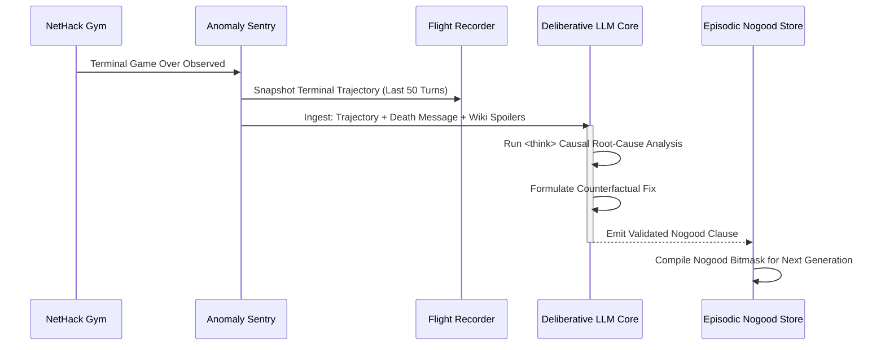

# Specification 07: Autopsy Pipeline & Benchmarking Suite

## 1. The In-Game Flight Recorder

The Flight Recorder maintains an in-memory, circular ring buffer of the last 100 game ticks. It records full epistemic and physical telemetry to enable causal post-mortem analysis:

```python
from dataclasses import dataclass
from typing import Any

@dataclass(slots=True, frozen=True)
class FlightRecordFrame:
    turn: int
    blstats: dict[str, int]
    terminal_message: str
    active_htn_goal: str
    dispatched_primitive: str
    dispatched_keystroke: str
    nearby_glyph_slice: list[list[int]]    # 9x9 grid around player
    inventory_belief_snapshot: dict[str, Any]
    detected_anomalies: list[str]

class FlightRecorder:
    def __init__(self, capacity: int = 100):
        self.capacity = capacity
        self.frames: list[FlightRecordFrame] = []

    def record(self, frame: FlightRecordFrame):
        self.frames.append(frame)
        if len(self.frames) > self.capacity:
            self.frames.pop(0)

    def get_trajectory(self, last_n: int = 50) -> list[FlightRecordFrame]:
        return self.frames[-last_n:]
```

---

## 2. Autopsy Pipeline & CDCL Nogood Generation

When the agent reaches terminal game over (`blstats.hp <= 0` or death prompt), the Autopsy Pipeline initiates cross-generational learning:



### Prompting Strategy for Autopsy
The Deliberative LLM receives:
1. **Death Summary**: The terminal game over string (e.g. `"You were killed by a floating eye."` or `"You died of food poisoning."`).
2. **50-Turn Action & Health Delta**: Sequence showing when health declined or paralysis occurred.
3. **True Post-Mortem Inventory**: Revealed items (identifying cursed status).
4. **Targeted Wiki Mechanics**: Ground-truth facts regarding the lethal entity.

### Autopsy Output Schema
The model performs root-cause deduction inside `<think>...</think>` tags and outputs the validated Pydantic `AutopsyReport` (Spec 04):
```json
{
  "death_cause": "Killed while paralyzed by floating eye passive gaze",
  "lethal_turn": 842,
  "causal_chain": [
    "Turn 839: Player stepped into melee range of floating eye.",
    "Turn 840: Executed MELEE_ATTACK ('k') against floating eye without blindness.",
    "Turn 841: Passive gaze induced 85 turns of paralysis.",
    "Turn 842: Adjacent jackal struck paralyzed player for lethal damage."
  ],
  "counterfactual_fix": "Player should have thrown daggers from range >= 2 or applied a blindfold before melee contact.",
  "nogood": {
    "trigger_predicates": {
      "adjacent_monster": "floating eye",
      "player_blind": false
    },
    "fatal_action": "MELEE_ATTACK",
    "derived_constraint": "FORBID: MELEE_ATTACK where target == 'floating eye' and not blind"
  }
}
```

---

## 3. Meta-Cognitive Competence Discovery Engine

Rather than relying on human assumptions about which character build is optimal, the cognitive OS incorporates a **Competence Discovery Engine** that autonomously measures its own capability profile:

```
[Diverse Archetype Trial Runs]
               │
               ▼
[Episodic Competence Telemetry]
- Survival Turns Distribution
- Median Dungeon Depth Achieved
- Nogood Density & Convergence Rate
- Fatal Dilemma Frequency
               │
               ▼
[Competence Objective Function C(theta)]
               │
               ▼
[Autonomous Selection of Optimal Persona for Ascension Run]
```

### Competence Scoring Function
For any evaluated persona configuration $\vec{\theta}$:

$$\mathcal{C}(\vec{\theta}) = w_1 \cdot \frac{\text{MedianDepth}(\vec{\theta})}{D_{\max}} + w_2 \cdot \frac{\text{MeanTurns}(\vec{\theta})}{T_{\max}} - w_3 \cdot \frac{\text{ActiveNogoodViolations}(\vec{\theta})}{N_{\text{total}}}$$

* High Competence Score ($\mathcal{C} \ge 0.80$): The agent demonstrates mastery over the tactical nuances, resource requirements, and combat mechanics of this persona.
* Low Competence Score: Frequent early fatal blunders indicating unresolved strategic gaps in the HTN method library for this playstyle.

---

## 4. Benchmarking Protocol vs AutoAscend

To rigorously validate superior performance, the system is tested against AutoAscend across two distinct experimental paradigms:

### Dual Evaluation Modes

#### Mode A: Blind Random Persona (`MODE_RANDOM_GENERALIST`)
* **Protocol**: 1,000 seeds initialized with random role, race, gender, and alignment.
* **Hypothesis**: AutoAscend's rule heuristics are brittle outside its hand-tuned baseline and will experience catastrophic failure on fragile or non-melee roles.
* **Target Metric**: Our system achieves **$>3\times$ higher median dungeon depth and survival turns** than AutoAscend under randomized conditions.

#### Mode B: Autonomous Competence Selection (`MODE_COMPETENCE_SELECTION`)
* **Protocol**: The agent explores persona clusters, calculates its Competence Matrix, selects its optimal persona, and runs 1,000 seeds targeting full ascension.
* **Target Metric**: Higher full ascension rate and deeper average dungeon progression than AutoAscend's published baseline under identical seeds.

### Standard Evaluation Metrics Table

| Metric | AutoAscend Baseline | Target (Our Cognitive OS) | Scientific Implication |
| :--- | :--- | :--- | :--- |
| **Full Ascension Rate** | $< 5\%$ | **$> 15\%$** | Decisive benchmark victory on primary game completion. |
| **Median Dungeon Depth** | 12 | **$\ge 20$** | Sustained mid-to-late game survival (Gehennom & Castle). |
| **Mean Turns Survived** | ~8,000 | **$\ge 25,000$** | Effective resource rationing and hunger clock control. |
| **Fatal Mistake Recurrence**| $100\%$ (Tabula Rasa) | **$0\%$ (CDCL Nogoods)** | Mathematical proof of cross-generational learning. |
| **Deadlock Loop Rate** | Significant | **$< 0.1\%$** | Elimination of spatial and heuristic oscillation loops. |

---

## 5. MiniHack Diagnostic Unit Testbed

To prevent regressions during development, the system is validated on isolated MiniHack task environments before full-game testing:

| MiniHack Test Suite | Focus Area | Success Criterion |
| :--- | :--- | :--- |
| `MiniHack-Sokoban-v0` | Spatial Navigation | 100% puzzle solve rate without trapping boulders. |
| `MiniHack-Corridor-Combat-v0` | Tactical Combat | Flawless corridor funneling and 0 surround deaths. |
| `MiniHack-FloatingEye-v0` | CDCL Nogood Pruning | 0 melee attempts against floating eye across 100 trials. |
| `MiniHack-Shop-PriceID-v0` | Epistemic Engine | Exact candidate reduction of unknown scrolls/potions. |
| `MiniHack-Altar-Testing-v0` | Bayesian BUC Belief | 100% accurate curse identification in $\le 5$ turns. |
