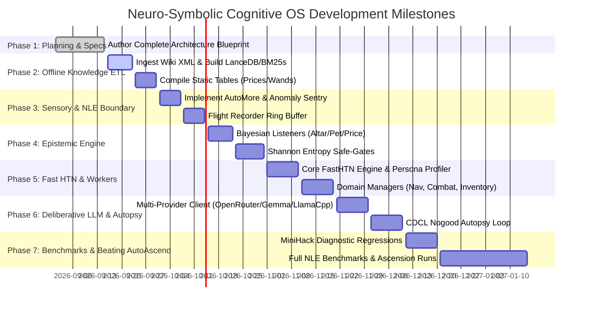

# Specification 08: Implementation Roadmap & Technology Stack

## 1. Complete Technology Stack Specification

```
┌─────────────────────────────────────────────────────────────────────────────────────────────┐
│                                 PRODUCTION TECHNOLOGY STACK                                 │
├─────────────────────────┬───────────────────────────────┬───────────────────────────────────┤
│ Layer                   │ Primary Library / Tool        │ Purpose / SLA                     │
├─────────────────────────┼───────────────────────────────┼───────────────────────────────────┤
│ Environment & Gym       │ `nle` (0.9.x)                 │ Core NetHack C-engine interface   │
│ Unit Testing Testbed    │ `minihack` (0.1.x)            │ Isolated tactical skill tests     │
│ Lexical Search          │ `bm25s`                       │ SciPy sparse BM25 (<0.2 ms)       │
│ Vector Storage          │ `lancedb` + `pyarrow`         │ In-process columnar vector DB     │
│ CPU Embeddings (ONNX)   │ `fastembed`                   │ BGE-small-en-v1.5 (0 MB VRAM)     │
│ Cross-Encoder (ONNX)    │ `flashrank`                   │ Strict-Null reranker (tau >= 0.82)│
│ Wiki ETL Parsers        │ `mwparserfromhell` + `wtp`    │ C-accelerated wiki text & tables  │
│ Deliberative LLM Client │ `openai` SDK + `httpx`        │ OpenRouter / Gemma / llama.cpp    │
│ Schema & Validation     │ `pydantic` (v2) + `json-repair`| Bulletproof structured parsing    │
│ Fast HTN Planner        │ Purpose-Built `FastHTN` (Py)  │ Sub-0.5 ms CDCL-pruned HTN search │
│ Fast Math & State       │ `numpy` + `scipy`             │ State bitmasks & belief arrays    │
│ Local LLM Server        │ `llama.cpp` (`llama-server`)  │ Local QwQ-32B serving (AWQ/GGUF)  │
└─────────────────────────┴───────────────────────────────┴───────────────────────────────────┘
```

### Python Environment Manifest (`requirements.txt`)
```text
# Simulation & RL Environment
nle>=0.9.0
minihack>=0.1.5

# Semantic Storage & Hybrid Retrieval
bm25s>=0.1.10
lancedb>=0.6.0
pyarrow>=15.0.0
fastembed>=0.2.7
flashrank>=0.2.0
onnxruntime>=1.17.0

# Offline Wiki Parsing
mwparserfromhell>=0.6.6
wikitextparser>=0.55.0

# Reasoning & Structured APIs
openai>=1.20.0
httpx>=0.27.0
pydantic>=2.6.0
json-repair>=0.18.0

# Numerics & Performance
numpy>=1.24.0
scipy>=1.10.0
cython>=3.0.0
```

---

## 2. Local Machine Learning Rig Serving Specification

When transitioning from the initial cloud API tier (OpenRouter / Google Gemma) to the dedicated home ML rig hosting **QwQ-32B**, the server runs via `llama.cpp`:

### `llama-server` Launch Command
```bash
./llama-server \
  --model ./models/qwq-32b-preview-q4_k_m.gguf \
  --ctx-size 8192 \
  --n-gpu-layers 99 \
  --threads 8 \
  --port 8080 \
  --host 0.0.0.0 \
  --temp 0.0 \
  --cont-batching
```

* **Quantization**: Q4_K_M GGUF (consumes ~20–22 GB VRAM on a single RTX 3090/4090).
* **Context Budget**: 8,192 tokens (ample for the 50-turn flight log + wiki rules + think scratchpad).
* **Temperature**: $0.0$ for deterministic causal analysis and repeatable autopsy output.
* **Standard API**: Serves `/v1/chat/completions` natively compatible with our `openai.AsyncOpenAI` client.

---

## 3. Phased Implementation Roadmap



---

## 4. Phase Verification Milestones

| Milestone | Deliverables & Verification Criteria | Exit Criteria |
| :--- | :--- | :--- |
| **M1: Offline Knowledge Base** | ETL script extracts full wiki; `bm25s` and `LanceDB` indices built; unit tests verify $<5\text{ ms}$ hybrid query and Strict-Null threshold $\tau \ge 0.82$. | 100% test pass rate on 200 NetHack fact queries. |
| **M2: Sensory & Physical Wrapper**| `AutoMoreWrapper` clears all dialogue prompts with zero delay; Anomaly Sentry fires interrupt on 20% HP drop. | 50,000 steps executed without prompt freeze. |
| **M3: Epistemic POMDP Engine** | Bayesian listeners correctly collapse BUC probabilities on altar drop and pet hesitation. | 100% accuracy on MiniHack item ID tasks. |
| **M4: Fast HTN & Navigation** | FastHTN evaluates in $<0.5\text{ ms}$; Sokoban solver completes 4 variant maps; Combat kiting avoids surround damage. | 100% Sokoban solve rate on MiniHack. |
| **M5: Deliberative LLM & Autopsy** | Multi-provider client parses `<think>` and validates Pydantic schemas; Nogood store persists fatal rules. | Floating eye death creates active Nogood. |
| **M6: Full Benchmark & Ascension**| 1,000-seed runs in `MODE_RANDOM_GENERALIST` and `MODE_COMPETENCE_SELECTION` against AutoAscend. | Superior median depth & ascension rate achieved. |

---

## 5. Technical Risk Matrix & Mitigation Strategies

| Identified Risk | Severity | Potential Impact | Technical Mitigation Strategy |
| :--- | :--- | :--- | :--- |
| **External LLM Rate Limits / API Downtime** | High | Free-tier cloud APIs (OpenRouter / Gemma) could throttle during long runs. | The Deliberative Core is dormant during 99.9% of play ticks; hard 8.0s timeout with fallback survival reflexes ensures the agent never freezes. Local `llama.cpp` completely eliminates network dependency. |
| **Malformed LLM Output on Smaller Models** | Medium | 32B models might occasionally drop closing JSON braces or emit invalid types. | Integrated `json-repair` automatically heals broken syntax; Pydantic enforces schema integrity; fallback defaults activate if unrecoverable. |
| **HTN Combinatorial Search Explosion** | High | Recursive task decomposition could exceed the 0.5 ms tick budget. | Search depth is strictly capped at $\le 15$; active Nogood bitmasks prune candidate branches in $<1\text{ microsecond}$; cycle detector stops loops. |
| **Over-Pruning by Episodic Nogoods** | Medium | A synthesized Nogood could be overly broad and prune valid non-fatal plays. | Nogoods require specific trigger predicates (e.g., target + weapon state + blindness status); candidate Nogoods undergo regression checks against the flight history before commit. |
| **NetHack C-Extension Compilation Issues** | Low | NLE dependencies can be finicky on newer Linux kernels / Python versions. | Strict pinning to Python 3.10 / 3.11 with containerized build recipes. |
