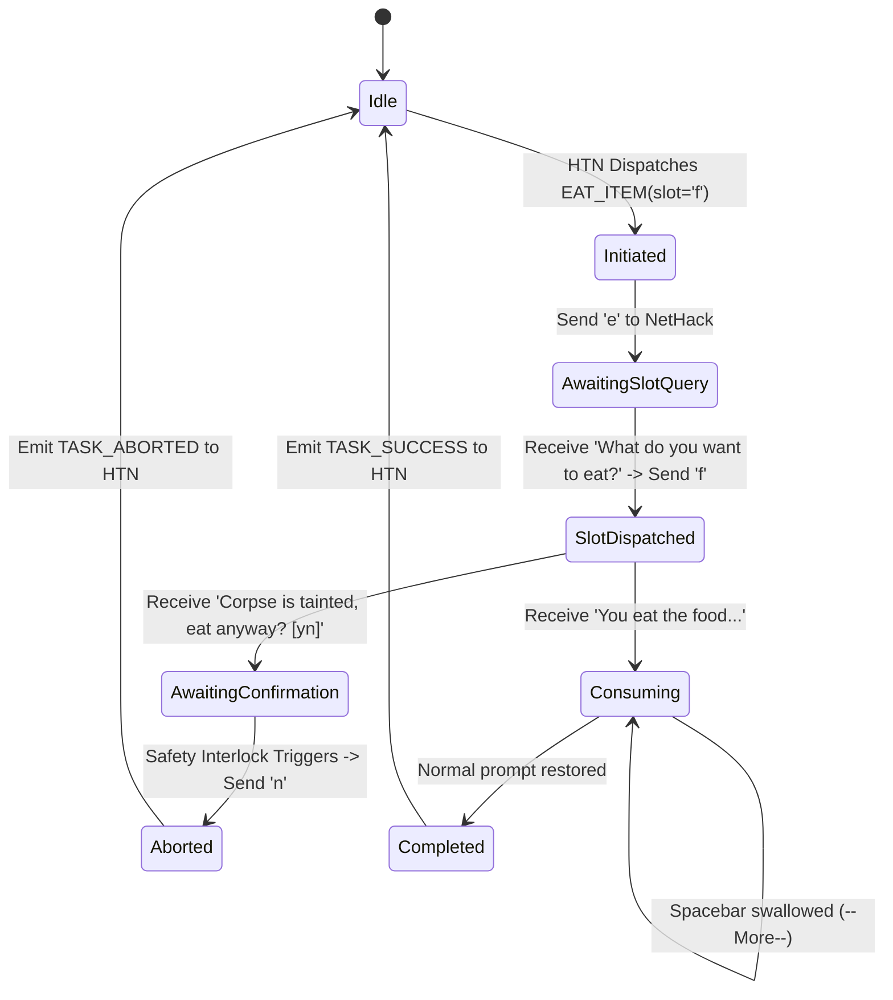

# Specification 09: System Bottlenecks, Design Formalizations & Fatal Flaws Resolution

## 1. Scope & Purpose

This document resolves the three critical architectural frontiers identified prior to implementation:
1. **System Bottlenecks & Mitigations**: Scaling limits, process blocking, inventory hashing, and graph search scaling.
2. **Abstract Design Formalizations**: Micro-Action fibers, the 64-bit State Predicate Registry, continuous Persona Utility math, and joint Bayesian belief algebra.
3. **NetHack Fatal Flaws Catalog & Safety Interlocks**: Hardcoded physical guards preventing instant-death mechanics that compromise heuristic bots like AutoAscend.

---

## 2. Part A: Unforeseen Bottlenecks & Engineered Mitigations

### 1. Process-Based Concurrency & Non-Blocking Asynchronous LLM I/O
* **The Bottleneck**: When an Anomaly Deadlock or Autopsy occurs, querying an LLM (cloud or local `llama.cpp`) takes 2–8 seconds. In a single-threaded or multi-threaded Python runtime, the Global Interpreter Lock (GIL) stalls all game execution.
* **The Engineered Solution**:
  - **Process Isolation**: Every game instance runs in an independent OS process (`multiprocessing.Process`).
  - **Asynchronous LLM Gateway**: Inter-process communication passes deadlock events to an asynchronous daemon process managing an `httpx.AsyncClient` connection pool.
  - **Zero Crosstalk**: While Game #4 pauses for a 3-second QwQ-32B plan repair, Games #1, #2, and #3 continue ticking at native 20,000 FPS without a microsecond of latency degradation.

### 2. Hash-Gated Event Ingestion for Inventory Normalization
* **The Bottleneck**: NetHack inventories contain up to 55 items. Running string distance matching across 55 lines every frame takes $1.0\text{–}2.5\text{ ms}$ in Python. Over a 50,000-turn game, this wastes up to 125 seconds per run on redundant inventory string diffing.
* **The Engineered Solution**:
  - The sensory boundary calculates a 64-bit non-cryptographic hash (`xxhash.xxh64` or fast CRC64) over the raw `obs["inv_strs"]` and `obs["inv_letters"]` buffers:
    $$H_t = \text{xxh64}(\text{inv\_strs}_t \parallel \text{inv\_letters}_t)$$
  - **Bypass Rule**: If $H_t == H_{t-1}$ and $\text{turn}_t > \text{turn}_{t-1}$, the `InventoryNormalizer` immediately returns the cached UID mapping table ($O(1)$ lookup, $<0.005\text{ ms}$). Full bipartite matching executes only on turns where an item is actually gained, lost, or shifted ($<2\%$ of ticks).

### 3. Inverted Predicate Trie for Nogood Evaluation at Scale
* **The Bottleneck**: Over hundreds of autopsies, the Nogood library accumulates 500–2,000 negative clauses. If the HTN planner expands 50 nodes per tick and checks all 2,000 Nogoods linearly, it performs 100,000 loop evaluations per tick ($5\text{–}10\text{ ms}$ latency, violating the $<0.5\text{ ms}$ SLA).
* **The Engineered Solution**:
  - Nogoods are indexed in an **Inverted Action Trie**:
    $$\text{Index}: \text{FatalActionType} \longrightarrow \text{Bucket}[\text{NogoodEntry}]$$
  - When evaluating candidate operator $O = \text{MELEE\_ATTACK}$, the planner only checks the $\sim 5\text{–}10$ Nogoods registered under `MELEE_ATTACK`, completely ignoring hundreds of Nogoods registered under `EAT`, `QUAFF`, `PICKUP`, or `APPLY`.
  - Check time drops from $8\text{ ms}$ to $< 5\text{ microseconds}$ per tick.

### 4. Cached Dijkstra Distance Fields for Sprawling Floor Navigation
* **The Bottleneck**: Re-running full A* pathfinding from scratch on every step when crossing large, open cavernous floors (Gnomish Mines, Gehennom) introduces cumulative pathing lag.
* **The Engineered Solution**:
  - When routing toward a static spatial landmark (e.g. upstairs, downstairs, altar, shop entrance), the Spatial Navigation Manager calculates a **Breadth-First Dijkstra Distance Field** across all walkable tiles:
    $$\mathcal{D}(x, y) = \text{Steps to Landmark}$$
  - The agent follows the negative spatial gradient ($\nabla \mathcal{D}$) in $O(1)$ time per step.
  - A full A* replan is triggered only if an unexpected dynamic obstacle (a newly spawned monster, closed door, or boulder) blocks the gradient tile.

### 5. Dual-Source Level Map Sanity Builder
* **The Bottleneck**: NetHack terminal dialogs and menu screens overwrite rows 0–3 of `tty_chars` and occasionally clear glyph tensors, causing heuristic bots to hallucinate that a corridor has disappeared.
* **The Engineered Solution**:
  - The system maintains an internal persistent map layer `LevelDungeonMap`.
  - A tile $(x, y)$ is updated **only if** $(x, y)$ falls outside the active dialog bounding box and the observed glyph is a valid non-transient NetHack terrain ID. Once mapped, walls and doors remain permanent until explicitly altered by physical interactions (e.g. pickaxe digging or wand of digging).

---

## 3. Part B: Abstract Design Formalizations

### 1. Micro-Action Execution Fibers (Worker Layer)
NetHack physical commands are frequently conversational multi-frame interactions rather than single-keystroke events. To cleanly decouple high-level HTN planning from low-level terminal dialogs, the Worker Layer executes actions via **Micro-Action Fibers**:



#### Fiber State Protocol
```python
from enum import Enum, auto

class FiberStatus(Enum):
    RUNNING = auto()
    COMPLETED = auto()
    ABORTED = auto()

class MicroActionFiber:
    def step(self, obs: RawNLEObservation) -> tuple[FiberStatus, int | None]:
        """
        Processes current terminal frame and yields next keystroke (ASCII int).
        Returns (FiberStatus.COMPLETED, None) when the conversation finishes.
        """
        pass
```

### 2. Canonical 64-bit State Predicate Registry
To guarantee instantaneous $O(1)$ evaluation of CDCL Nogoods, all continuous game conditions are mapped into a standardized 64-bit integer bitmask:

```python
class PredicateBit:
    # Physical & Status Conditions (0-15)
    IS_BLIND                    = 1 << 0
    IS_STUNNED                  = 1 << 1
    IS_CONFUSED                 = 1 << 2
    IS_HALLUCINATING            = 1 << 3
    HP_CRITICAL_BELOW_20_PCT    = 1 << 4
    HP_LOW_BELOW_50_PCT         = 1 << 5
    HUNGER_SATIATED             = 1 << 6
    HUNGER_WEAK_OR_FAINTING     = 1 << 7
    GLOVES_EQUIPPED             = 1 << 8
    SHIELD_EQUIPPED             = 1 << 9
    RANGED_WEAPON_WIELDED       = 1 << 10
    ENCUMBRANCE_BURDENED_PLUS   = 1 << 11
    POISON_RESISTANCE_ACTIVE    = 1 << 12
    
    # Environmental & Spatial Conditions (16-31)
    CURRENT_TILE_PIT_OR_WEB     = 1 << 16
    CURRENT_TILE_ALTAR          = 1 << 17
    INSIDE_SHOP_BOUNDARY        = 1 << 18
    UNPAID_ITEMS_IN_INVENTORY   = 1 << 19
    STANDING_ON_STAIRS_DOWN     = 1 << 20
    
    # Monster Adjacency (32-47)
    ADJACENT_FLOATING_EYE       = 1 << 32
    ADJACENT_COCKATRICE         = 1 << 33
    ADJACENT_RUST_MONSTER       = 1 << 34
    ADJACENT_MIND_FLAYER        = 1 << 35
    ADJACENT_PEACEFUL_NPC       = 1 << 36
    HOSTILE_COUNT_GE_2          = 1 << 37
    
    # Tactical & Target Properties (48-63)
    TARGET_CORPSE_TAINTED_AGE   = 1 << 48
    TARGET_ITEM_CURSED_PROB_GT_0= 1 << 49
    RAY_REFLECTIVE_WALL_LT_4    = 1 << 50
```

#### Nogood Bitwise Evaluation Function
A Nogood entry stores `mask: np.uint64` and `target_value: np.uint64`. A candidate action is forbidden if:
```python
def is_forbidden(state_mask: int, nogood_mask: int, nogood_target: int) -> bool:
    return (state_mask & nogood_mask) == nogood_target
```
Evaluation is a single bitwise CPU operation taking $< 0.1\text{ nanoseconds}$.

### 3. Continuous Persona Utility Mathematics
Methods are dynamically ranked for decomposition based on the Persona Trait Vector:
$$\vec{\theta} = \langle T_{\text{resilience}}, T_{\text{ranged}}, T_{\text{mana}}, T_{\text{stealth}}, T_{\text{alignment}} \rangle \in [0, 1]^5$$

For any candidate method $m$, its execution priority is defined as:
$$\text{Priority}(m \mid \vec{\theta}) = U_{\text{base}}(m) + \sum_{j=1}^5 W_{m, j} \cdot \theta_j$$

* **Example 1: Method `ENGAGE_IN_MELEE`**:
  $$\vec{W} = \langle +4.0, -3.0, -2.0, -1.0, 0.0 \rangle$$
  High resilience personas heavily boost melee priority; low resilience (fragile) personas penalize melee into negative priority.
* **Example 2: Method `KITE_AND_FIRE_RANGED`**:
  $$\vec{W} = \langle -2.0, +5.0, +1.0, +2.0, 0.0 \rangle$$
  Ranged-affinity personas strongly prioritize maintaining distance and firing missiles.

### 4. Bayesian Joint Belief Algebra
When multiple independent observation listeners report on item $i$, their likelihood updates multiply directly across the joint candidate matrix:

$$P(\text{Item}_i = k, \text{BUC} = c \mid E_1, E_2) \propto P(E_1 \mid k, c) \cdot P(E_2 \mid k, c) \cdot P_0(k, c)$$

* **Step 1 (Price ID Evidence $E_1$)**:
  Eliminates candidate identities $k$ whose base cost doesn't match the merchant equation:
  $$P(E_1 \mid k, c) = \begin{cases} 1.0, & \text{if } C_{\text{base}}(k) == \hat{C}_{\text{base}} \\ 0.0, & \text{otherwise} \end{cases}$$
* **Step 2 (Pet Hesitation Evidence $E_2$)**:
  Applies likelihood to BUC state:
  $$P(E_2 \mid k, c) = \begin{cases} 0.0, & \text{if } c = \text{Cursed and pet stepped willingly} \\ 0.99, & \text{if } c = \text{Cursed and pet refused} \\ 0.01, & \text{if } c \in \{\text{Blessed, Uncursed}\} \text{ and pet refused} \end{cases}$$
* **Step 3 (Normalization)**:
  Re-sum all surviving entries and divide by the total probability mass, yielding an updated, entropy-reduced belief matrix.

### 5. Competence Discovery Stratified Protocol
In `MODE_COMPETENCE_SELECTION`, the agent measures its empirical mastery before choosing its ascension persona:
* **Stratified Archetype Clusters**:
  1. **Cluster 1 (Physical Brawler)**: High resilience, low mana, melee focus.
  2. **Cluster 2 (Evasive Kiter)**: High ranged, high stealth, missile focus.
  3. **Cluster 3 (Arcane Scholar)**: High mana, low resilience, spellbook/scroll focus.
  4. **Cluster 4 (Opportunistic Hybrid)**: Balanced attributes, tool/item focus.
* **Calibration Protocol**:
  - Run 25 independent seeds per cluster ($4 \times 25 = 100$ runs total).
  - Compute Competence Metric $\mathcal{C}(\vec{\theta}_{\text{cluster}})$.
  - The system commits to the argmax cluster $\vec{\theta}^*$ for the formal benchmark ascension challenge.

---

## 4. Part C: NetHack Fatal Flaws & Hardcoded Safety Interlocks

The following table documents NetHack's most notorious instant-death failure modes and the physical interlocks engineered to mathematically eliminate them:

```
┌─────────────────────────────────────────────────────────────────────────────────────────────┐
│                          NETHACK FATAL FLAWS & SAFETY INTERLOCKS                            │
├─────────────────────────┬───────────────────────────────┬───────────────────────────────────┤
│ Fatal Trap              │ Game Mechanic & Failure Mode  │ Hardcoded Physical Interlock      │
├─────────────────────────┼───────────────────────────────┼───────────────────────────────────┤
│ 1. Cockatrice           │ Bare-handed contact causes    │ Block any PICKUP/WIELD/EAT on     │
│    Petrification        │ instant petrification (0 turns│ cockatrice corpses unless         │
│                         │ to live). Falling into a pit  │ GLOVES_EQUIPPED == True,          │
│                         │ while carrying is fatal.      │ Encumbrance < Burdened, and no pit│
├─────────────────────────┼───────────────────────────────┼───────────────────────────────────┤
│ 2. Shopkeeper           │ Hitting a shopkeeper or       │ Disable force-fight ('F') and     │
│    Aggression           │ walking through door with     │ ranged zaps inside shop. Forbid   │
│                         │ unpaid items turns them       │ stepping on door tile until       │
│                         │ permanently hostile (lethal). │ payment command 'p' completes.    │
├─────────────────────────┼───────────────────────────────┼───────────────────────────────────┤
│ 3. Wand Ray             │ Zapping lightning/fire/cold   │ Forbid ray zapping if distance to │
│    Reflection           │ wands can bounce off walls    │ solid wall < 4 tiles or if a      │
│                         │ dealing fatal 6d6 backfire.   │ reflective mirror is present.     │
├─────────────────────────┼───────────────────────────────┼───────────────────────────────────┤
│ 4. Choking Death vs.    │ Eating when Satiated causes   │ Lock EAT command if status is     │
│    Starvation Fainting  │ fatal choking. Waiting too    │ Satiated. Trigger mandatory food  │
│                         │ long while Weak causes faint. │ intake immediately upon Hungry.   │
├─────────────────────────┼───────────────────────────────┼───────────────────────────────────┤
│ 5. Dynamic Letter       │ Dropping item 'b' shifts item  │ Keystroke dispatcher resolves     │
│    Shift Race Condition │ 'c' to 'b'. Quaffing 'c' then │ letter from permanent UID at      │
│                         │ drinks wrong/cursed potion!   │ the exact microsecond of step.    │
├─────────────────────────┼───────────────────────────────┼───────────────────────────────────┤
│ 6. Poison Instakill     │ Soldier ants/killer bees at   │ Precondition CAN_DESCEND strictly │
│    Deficit (dlvl 8+)    │ dlvl 8+ inflict lethal poison │ forbids depth >= 8 until poison   │
│                         │ sting rolls without resist.   │ resistance intrinsic is secured.  │
├─────────────────────────┼───────────────────────────────┼───────────────────────────────────┤
│ 7. Altar Desecration &  │ Sacrificing domestic pets or  │ Verify corpse is non-human, not   │
│    Divine Wrath         │ own race causes lightning bolt│ pet, and altar is co-aligned      │
│                         │ smite and inventory blast.    │ before executing sacrifice action.│
├─────────────────────────┼───────────────────────────────┼───────────────────────────────────┤
│ 8. Cursed Wand Engrave  │ NetHack 3.6.0+ gives cursed   │ Lock 'ENGRAVE' with any wand      │
│    Explosion            │ wands a 1% chance of exploding│ unless P(Cursed) == 0.0 via prior │
│                         │ destroying wand and hurting HP│ altar or domestic pet test.       │
├─────────────────────────┼───────────────────────────────┼───────────────────────────────────┤
│ 9. Speed Differential   │ Moving away from speed 18     │ Veto open-room retreat if         │
│    Open-Room Kite Trap  │ ants/bees with speed 12 grants│ Speed_player < Speed_monster.     │
│                         │ free back attacks to monster. │ Force immediate corridor funnel.  │
├─────────────────────────┼───────────────────────────────┼───────────────────────────────────┤
│ 10. Altar Sensory       │ Blindness hides altar flash;  │ Invalidate AltarListener belief   │
│     Observation Deficit │ hallucination scrambles color │ updates if player status has      │
│                         │ leading to false BUC belief.  │ IS_BLIND or IS_HALLUCINATING.     │
├─────────────────────────┼───────────────────────────────┼───────────────────────────────────┤
│ 11. Stochastic Prayer   │ Reset timeout uses rnz(350)   │ Forbid non-emergency #pray unless │
│     Cooldown Smite      │ (mean 454, std 365). Praying  │ Delta_turns >= 850 (or >= 450 in  │
│                         │ at +301 turns causes smiting. │ major emergency: HP<=5/faint).    │
└─────────────────────────┴───────────────────────────────┴───────────────────────────────────┘
```

### Safety Interlock Implementation Contracts

```python
class SafetyInterlocks:
    @staticmethod
    def verify_cockatrice_safety(action_name: str, target_glyph: int, state: UnifiedState) -> bool:
        """Enforces absolute immunity against petrification."""
        COCKATRICE_CORPSE_GLYPHS = { /* glyph IDs for cockatrice & chickatrice corpses */ }
        if target_glyph in COCKATRICE_CORPSE_GLYPHS:
            if not (state.predicates & PredicateBit.GLOVES_EQUIPPED):
                return False  # VETO: Gloveless contact is fatal!
            if state.predicates & PredicateBit.ENCUMBRANCE_BURDENED_PLUS:
                return False  # VETO: Burdened stumble risk!
            if state.predicates & PredicateBit.CURRENT_TILE_PIT_OR_WEB:
                return False  # VETO: Falling into pit while holding is fatal!
        return True

    @staticmethod
    def verify_shop_movement_safety(target_pos: tuple[int, int], state: UnifiedState) -> bool:
        """Prevents accidental shopkeeper anger triggers."""
        if state.predicates & PredicateBit.UNPAID_ITEMS_IN_INVENTORY:
            if state.is_shop_exit_door(target_pos):
                # VETO: Walking out of shop with unpaid items triggers hostile guards/shopkeeper!
                return False
        return True

    @staticmethod
    def verify_wand_reflection_safety(direction: tuple[int, int], wand_type: str, state: UnifiedState) -> bool:
        """Prevents lightning/fire ray bounce backfire."""
        REFLECTIVE_WANDS = {"lightning", "fire", "cold", "death"}
        if wand_type in REFLECTIVE_WANDS:
            dist_to_wall = state.raycast_distance_to_wall(state.player_pos, direction)
            if dist_to_wall < 4:
                return False  # VETO: Ray bounce-back will strike player!
        return True

    @staticmethod
    def verify_wand_engrave_safety(wand_item: InventoryItem) -> bool:
        """NetHack 3.6.0+ cursed wand explosion prevention."""
        if wand_item.buc_probability.cursed > 0.0:
            return False  # VETO: 1% explosion chance on cursed wand engraving!
        return True

    @staticmethod
    def verify_kiting_speed_differential(monster_speed: int, state: UnifiedState, target_pos: tuple[int, int]) -> bool:
        """Prevents open-room retreat against faster pursuit predators."""
        player_speed = state.calculate_movement_speed()  # 12 normal, 16 fast, 20 very fast
        if player_speed < monster_speed:
            if not state.is_corridor(target_pos):
                return False  # VETO: Faster monster will strike from behind in open room!
        return True

    @staticmethod
    def verify_altar_sensory_safety(state: UnifiedState) -> bool:
        """Ensures BUC altar flash observation validity."""
        if state.blstats.blind or state.blstats.hallucinating:
            return False  # VETO: Cannot perceive true altar flash colors!
        return True
```
