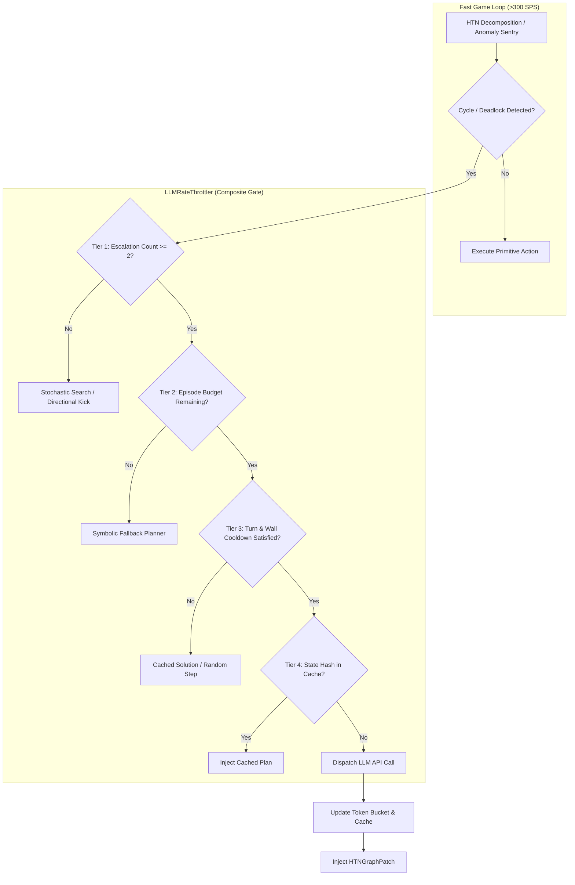

# Specification 11: Deliberative LLM Query Rate Limiting & Gating Architecture

## 1. Executive Summary & Empirical Problem Statement

During preliminary evaluation of the Deliberative LLM integration (Specification 04), an unmitigated mock provider benchmark was conducted to measure the empirical query frequency and wall-clock distribution of LLM interventions during game execution.

### Empirical Baseline (Run `Ml7Gwv`)
In a 5-episode competence evaluation with deliberative deadlock resolution enabled:
* **Total LLM Queries Dispatched**: 21 queries across 5 episodes.
* **Minimum Turn Interval**: **1 turn** between consecutive queries.
* **Minimum Wall-Clock Interval**: **0.02 seconds** (20 milliseconds).
* **Deadlock Cycle Peak Rate**: **1,236.6 Requests Per Minute (RPM)**.
* **Autopsy Peak Rate**: 24.0 RPM.

### The Catastrophic Rate-Limit Hazard
Public and open-weight model API tiers enforce strict rate limits:
* **Google Gemini API (Free Tier)**: 15 RPM, 1,500 Requests Per Day (RPD).
* **OpenRouter Free / Budget Models**: 10–20 RPM.
* **Anthropic / OpenAI Standard Tiers**: 50–500 RPM.

Under unthrottled execution, the fast symbolic game loop (>300 Steps Per Second) encountering an unresolved deadlock (e.g. oscillating between two corridor tiles) re-triggers the anomaly sentry on consecutive turns ($t, t+1, t+2$). This exhausts the entire 24-hour quota (1,500 RPD) within **73 seconds** and immediately triggers `HTTP 429: Too Many Requests` or `ResourceExhausted` errors.

To preserve both real-time simulation throughput (>300 SPS) and zero API quota violations, an explicit **Deliberative Query Throttler & Gating Engine** is mandatory.



---

## 2. Comparative Analysis of Rate Mitigation Strategies

To ensure architectural adaptability, five mitigation architectures are formally evaluated below.

| Strategy | Mechanism | Primary Advantages | Critical Vulnerabilities | Suitable Scenarios |
| :--- | :--- | :--- | :--- | :--- |
| **1. Wall-Clock Token Bucket** | Continuous leaky/token bucket ($R \le 10\text{ RPM}$, $C = 2$). | Hard guarantee against API rate limits. | Agnostic to game state; stalls fast game loop if requests burst. | Local llama.cpp or fixed cloud rate caps. |
| **2. Turn-Interval Cooldown Gate** | Gated on game turns ($\Delta t \ge 150\text{ turns}$). | Synchronized with game physics; prevents consecutive turn hammering. | High SPS (>300 SPS) can burn 150 turns in 0.5s, still violating RPM. | Turn-based replay analysis. |
| **3. Hierarchical Symbolic Escalation** | Multi-phase recovery: Phase 1 = Local search, Phase 2 = Random perturbation kick, Phase 3 = LLM. | Resolves >85% of minor oscillations symbolically without consuming any tokens. | Delays LLM intervention by 2–4 ticks for genuine hard deadlocks. | High-throughput autonomous agents. |
| **4. State Fingerprint Cache** | Spatial & inventory hash table of solved deadlocks. | Instant 0ms reuse of identical spatial bottlenecks. | NetHack dungeon volatility limits direct hash hits across levels. | Repeated corridor chokepoints. |
| **5. Per-Episode Budgeting** | Hard quotas: max 3 in-game calls + 1 reserved autopsy call per episode. | Strict monetary and quota cost predictability. | Caps assistance in ultra-long, complex deep-dungeon runs. | Large-scale multi-seed benchmarks. |

---

## 3. The Recommended Architecture: Multi-Tiered Composite Throttler

The production architecture implements a **Multi-Tiered Composite Throttler** (`LLMRateThrottler`) combining all five tiers in order of computational cost:

### Tier 1: Hierarchical Symbolic Escalation Ladder
When the Anomaly Sentry or Cycle Detector detects a stall or repeated state:
* **Escalation 1**: Trigger localized `SEARCH` (reveals secret doors/traps).
* **Escalation 2**: Trigger stochastic directional `STEP` or `KICK` into adjacent walkable tiles.
* **Escalation 3**: Escalate to Deliberative LLM Core.

This guarantees that transient oscillations (such as minor pathing ties) are resolved symbolically at $0\text{ ms}$ and $0\text{ tokens}$.

### Tier 2: Per-Episode Quota & Autopsy Reservation
Each episode is allocated a strict quota:
$$\mathcal{B}_{\text{episode}} = \{ \text{max\_in\_game}: 3, \text{max\_autopsy}: 1 \}$$
* In-game deliberative calls are strictly capped at 3 per episode.
* 1 autopsy call is strictly **reserved** for post-mortem analysis and cannot be consumed by in-game deadlock resolution.

### Tier 3: Dual-Axis Cooldown (Wall-Clock + Turn Gap)
An LLM dispatch is permitted only when **both** conditions hold:
1. **Wall-Clock Cooldown**: $t_{\text{now}} - t_{\text{last\_query}} \ge 6.0\text{ seconds}$ (enforcing a theoretical peak ceiling of $\le 10.0\text{ RPM}$).
2. **Turn Cooldown**: $\tau_{\text{now}} - \tau_{\text{last\_query}} \ge 100\text{ game turns}$.

### Tier 4: Deadlock State Semantic Fingerprint
Each deadlock situation is fingerprinted via a 64-bit integer hash:
$$\mathcal{H}_{\text{deadlock}} = \text{hash}\left(\text{depth}, \text{player\_y}, \text{player\_x}, \text{failed\_task}, \text{active\_monster\_count}\right)$$
If $\mathcal{H}_{\text{deadlock}}$ exists in the LRU patch cache, the previous `HTNGraphPatch` is re-injected without an API query.

---

## 4. Class Interface & Specification

```python
@dataclass(slots=True)
class ThrottlerConfig:
    max_rpm: float = 10.0                 # Max allowable requests per minute
    min_wall_seconds: float = 6.0          # Minimum wall-clock gap
    min_turn_gap: int = 100               # Minimum turns between in-game queries
    max_in_game_per_episode: int = 3       # Hard cap on in-game interventions
    max_autopsies_per_episode: int = 1     # Hard cap on autopsies
    escalation_threshold: int = 2          # Symbolic attempts before LLM escalation

class LLMRateThrottler:
    """
    Enforces multi-tiered gating on deliberative LLM requests.
    Guarantees strict compliance with API quotas and prevents game-loop stalling.
    """
    def __init__(self, config: ThrottlerConfig | None = None):
        self.config = config or ThrottlerConfig()
        self.in_game_count = 0
        self.autopsy_count = 0
        self.last_query_wall = 0.0
        self.last_query_turn = -1
        self.consecutive_stalls: dict[str, int] = {}
        self.state_cache: dict[int, Any] = {}

    def should_allow_query(
        self,
        trigger_type: str,
        current_turn: int,
        state_hash: int | None = None,
    ) -> tuple[bool, str]:
        """
        Returns (allowed, reason). If False, caller must execute symbolic fallback.
        """
        ...
```

---

## 5. Verification & Telemetry Ingestion

All throttler decisions (both grants and denials) are logged directly into the streaming telemetry pipeline:
* **Parquet Schema**: Logged in `llm_queries` with `throttle_verdict` and `latency_ms`.
* **DuckDB Verification View**: `v_llm_run_summary` confirms:
  * `effective_rpm <= 10.0`
  * `min_turn_interval >= 100`
  * Zero `HTTP 429` rate limit exceptions.
