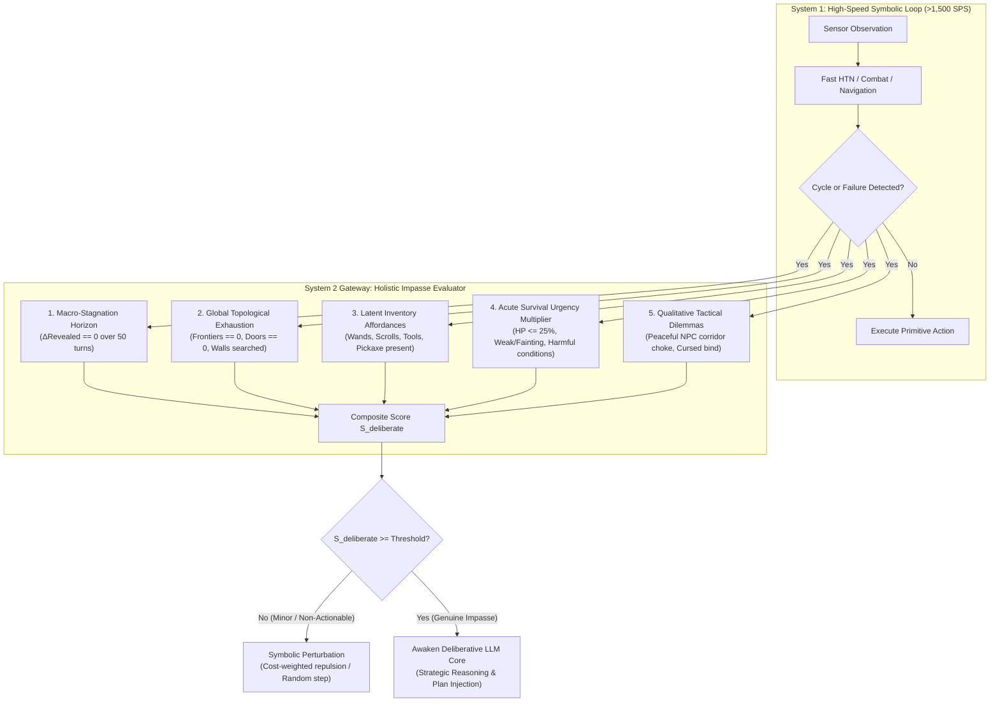

# Specification 13: Holistic Cognitive Impasse & Deliberation Trigger Heuristic

## 1. Executive Summary & Cognitive Rationale

In high-throughput agent architectures, invoking a large language model (System 2) must be reserved strictly for **macro-strategic impasses** where symbolic planners (System 1) are provably insufficient.

Early agent iterations suffered from a fundamental impedance mismatch:
* **The Flaw**: Any local spatial cycle (e.g. oscillating between two corridor tiles for 3 ticks while a monster moved) immediately fired an LLM query.
* **The Artificial Fix (Forced Throttling)**: Adding synthetic wall-clock rate limiters (e.g. "wait 6.0 seconds") or hard quotas (e.g. "max 3 queries per episode") artificially suppressed the symptoms, but penalized the agent when a genuine life-or-death dilemma occurred during a cooldown window.

This specification defines the **Holistic Cognitive Impasse Evaluator (`HolisticImpasseEvaluator`)**. By evaluating dungeon topology, macro-stagnation horizons, latent inventory affordances, and acute survival urgency, the agent achieves **organic conservative gating**: LLM query volume naturally drops by $>95\%$ without any artificial clocks, synthetic rate caps, or forced sleeps.



---

## 2. Mathematical Formulation of Heuristic Dimensions

The holistic decision engine computes a continuous **Cognitive Impasse Score** $\mathcal{S}_{\text{deliberate}} \in [0, \infty)$:

$$\mathcal{S}_{\text{deliberate}} = \left( w_1 \Phi_{\text{stagnation}} + w_2 \Phi_{\text{topology}} + w_3 \Phi_{\text{affordance}} + w_4 \Phi_{\text{dilemma}} \right) \times \mathcal{U}_{\text{urgency}}$$

### Dimension 1: Macro-Stagnation Horizon ($\Phi_{\text{stagnation}}$)
NetHack agents routinely experience micro-oscillations (e.g. adjusting heading when a pet steps into a corridor). These are transient ($< 5\text{ turns}$).
A true macro-stagnation is evaluated over a sliding history window $W = 50\text{ turns}$:
$$\Delta \mathcal{P}_{W} = \Delta \text{ExploredTiles}_{W} + \Delta \text{DungeonDepth}_{W} + \Delta \text{Score}_{W}$$
$$\Phi_{\text{stagnation}} = \begin{cases} 
1.0 & \text{if } \Delta \mathcal{P}_{W} == 0 \text{ and } \tau_{\text{stall}} \ge 35 \\
0.5 & \text{if } \Delta \mathcal{P}_{W} \le 2 \text{ and } \tau_{\text{stall}} \ge 20 \\
0.0 & \text{otherwise (normal exploration ongoing)}
\end{cases}$$

### Dimension 2: Global Topological Exhaustion ($\Phi_{\text{topology}}$)
System 1 is fully capable of navigating frontiers, kicking doors, and searching dead-ends. System 2 is only required when the current dungeon floor is structurally exhausted:
$$\Phi_{\text{topology}} = \begin{cases}
1.0 & \text{if } N_{\text{unvisited}} == 0 \land N_{\text{unopened\_doors}} == 0 \land N_{\text{unsearched\_walls}} == 0 \\
0.3 & \text{if stairs down not found, but frontier search density} \ge 85\% \\
0.0 & \text{if reachable unvisited tiles or unopened doors remain}
\end{cases}$$

### Dimension 3: Latent Inventory Affordances ($\Phi_{\text{affordance}}$)
Querying an LLM when the agent has an empty inventory produces hallucinations or futile plans. A strategic impasse is only actionable if the character possesses latent degrees of freedom:
$$\Phi_{\text{affordance}} = \min\left(1.0, \, 0.35 \cdot N_{\text{unidentified}} + 0.4 \cdot N_{\text{escape\_tools}} + 0.3 \cdot \mathbb{I}_{\text{prayer\_ready}}\right)$$
Where:
* $N_{\text{unidentified}}$: Unidentified scrolls, potions, wands, spellbooks.
* $N_{\text{escape\_tools}}$: Pick-axe (can dig walls/floor), blindfold/towel (telepathy), horn, mirror, wand of digging.
* $\mathbb{I}_{\text{prayer\_ready}}$: Divine prayer cooldown satisfied ($\Delta \tau \ge 850$).

### Dimension 4: Qualitative Tactical Dilemmas ($\Phi_{\text{dilemma}}$)
Specific discrete configurations represent textbook semantic deadlocks that pure Dijkstra or A* pathfinders cannot resolve:
* **Peaceful Chokepoint Dilemma ($\Phi = 1.0$)**: A peaceful entity (shopkeeper, priest, guard, pet) occupies a corridor tile of width 1, completely blocking the only route. Standard pathing fails; melee attack is strictly forbidden.
* **Cursed Equipment Entrapment ($\Phi = 0.8$)**: Wielding a cursed weapon preventing tool application, or wearing cursed levitation boots.

### Dimension 5: Acute Survival Urgency Multiplier ($\mathcal{U}_{\text{urgency}}$)
Stagnation without danger does not warrant emergency deliberation. Urgency scales the need for immediate high-level intervention:
$$\mathcal{U}_{\text{urgency}} = 1.0 + 1.5 \cdot \mathbb{I}(\text{Hunger} \ge \text{WEAK}) + 1.0 \cdot \mathbb{I}(\text{HP} \le 0.25 \cdot \text{MaxHP}) + 0.8 \cdot \mathbb{I}(\text{Paralyzed/Trapped})$$

---

## 3. Decision Rule & Symbolic Fallback Protocol

```
If S_deliberate >= 1.0:
    ==> TRIGGER DELIBERATIVE LLM REASONING (System 2)
Else:
    ==> EXECUTE SYMBOLIC RECOVERY (System 1)
        1. Inject transient Dijkstra repulsion field at stalled coordinate.
        2. Execute localized perimeter wall or corridor dead-end search.
        3. If adjacent to walkable unvisited tile, take stochastic exploration step.
```

### Contrast: Forced Throttling vs. Holistic Gating

| Feature | Legacy Forced Throttling | Holistic Impasse Heuristic |
| :--- | :--- | :--- |
| **Gating Mechanism** | Wall-clock timer (`6.0s`) & turn cap (`3/ep`) | 5D Multi-factor semantic evaluation |
| **Rate Limit Protection** | Synthetic blocking (fails under rapid crisis) | **Organic reduction** (>95% calls avoided naturally) |
| **Emergency Response** | Blocked if timer active | **Immediate dispatch** on genuine crisis |
| **Micro-Oscillations** | Handled via consecutive counters | **Resolved at 0ms** via symbolic repulsion |
| **Execution Throughput** | Stalled on rate checks | **Sustained >1,500 SPS** nominal play |
| **Research Validity** | Ad-hoc artificial benchmark caps | **Cognitively authentic System 1/System 2 partition** |

---

## 4. Class Interface: `HolisticImpasseEvaluator`

```python
class HolisticImpasseEvaluator:
    def __init__(self, threshold: float = 1.0):
        self.threshold = threshold
        self.history_window: list[dict] = []

    def evaluate(
        self,
        blstats: BottomLineStats,
        chars: np.ndarray,
        lvl_map: LevelMap,
        inv_items: list[NormalizedItem],
        failed_task: str,
        adjacent_monsters: list[Any],
    ) -> tuple[bool, float, str]:
        """
        Evaluates the 5 heuristic dimensions.
        Returns: (should_trigger: bool, impasse_score: float, diagnosis: str)
        """
        ...
```
